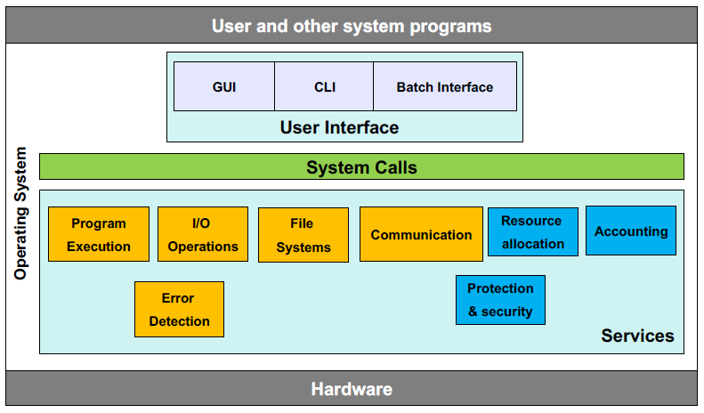

> # System Call ?
> 출처 : 운영체제 아주 쉬운 세 가지 이야기
--- 
 

# 시스템 콜이 무엇인가 ?
시스템 콜(System Call)은 사용자 프로그램이 운영체제 커널이 제공하는 기능에 접근하기 위한 프로그래밍 인터페이스(=함수)다. 사용자 프로그램이 직접 하드웨어 자원에 접근하는 것은 보안과 안정성이 확보되지 않기에 위험하다. 커널의 기능들은 운영체제에 큰 영향을 끼치기 때문에 이를 운영체제에서 직접 자원을 관리하기 위해 시스템 콜이 개발되었다.

 

# 왜 커널 기능을 사용자 프로그램이 사용하면 위험할까?
### 인스톨러는 슈뢰딩거의 고양이다.
사용자 프로그램이 항상 운영체제에 호의적이지 않다. 우리는 컴퓨터를 다루면서 랜섬웨어, 좀비PC 등 다양한 바이러스 프로그램 혹은 안티 프로그램을 많이 만나온다. 익명을 바탕으로 이루어진 인터넷 공간은 우리에게 항상 진실만을 보이지 않는다. 

내가 원하는 프로그램을 찾고 설명을 읽고 프로그램을 설치한다. 프로그램이 정상적이라면 정말 좋은 일이다. 하지만, 프로그램에 악의적인 코드가 들어있다면 우리는 하드웨어에 있는 소중한 자원들을 지킬 수 없다.

### 프로그램을 만드는 것은 사람이다.
사람은 AI가 아니다. 20년 경력의 행복한 프로그래머도 프로그래밍을 하다가 실수 할 수 있다. 단순히 `Resource` 파일의 경로를 잘못 지정한 일이라면 우스운 헤프닝으로 끝날 수 있다. 하지만 하드웨어의 중요한 부분에서 실수를 했다면? 내가 만든 프로그램이 다른 프로그램에 영향을 끼친다면?(멋있는 일이 될지도 모른다.) 행복한 프로그래머가 아니라, 행복했던 백수가 남을지도 모른다..

### 결론적으로
하드웨어의 중요한 기능들은 운영체제 관점에서 관리를 하는 것이 보안과 안정성이 확보되는 좋은 지점이다. 또, 운영체제에서 관리를 해주기 때문에 프로그래머는 하드웨어의 기능을 모르는 상태에서도 하드웨어를 효율적으로 사용할 수 있다.

 

# 정리하면 시스템 콜이 필요한 이유는 이렇다.
### 1. 보안 향상 : 사용자 프로그램이 직접 하드웨어를 다루지 않음으로서 하드웨어의 시스템이 은닉할 수 있다.
### 2. 안정성 확보 : 자원을 효율적이고 모든 사용자 프로그램에 공정하게 관리할 수 있다.
### 3. 추상화 : 하드웨어의 세부 사항을 프로그래머가 알 필요가 없지만 하드웨어의 기능을 다양하게 사용할 수 있다.

 

# 시스템 콜의 동작 흐름 : 사용자 프로그램 -> 커널
나는 프로그래밍을 하면서 직접적으로 시스템 콜을 호출해본 경험은 크래프톤 정글에서 `PintOS` 과제를 수행할 당시 말고는 없었다. 그런데도 시스템 콜을 사용하고 있었다니? 이런 의문이 당연하다. 시스템 콜은 직접적 호출이 아닌, 간접적 호출에 많이 기대기 때문이다.

우리가 프로그래밍을 처음 배울 때 흔히 접하는 출력문(`printf, cout, console.writeline 등`)이 시스템 콜을 사용해봤다는 증거다. 언어는 내부 구현에서 시스템 콜을 랩핑한 상태로 프로그래머들에게 보여진다. 우리가 사용하는 프로그램도 이미 수많은 시스템 콜의 집합이다. 사용자 프로그램을 출발해서 시스템 콜이 동작하는 방식을 보자.

### 1. 사용자 프로그램이 시스템 콜 호출
- 사용자 프로그램은 보통 라이브러리 함수를 호출함으로서 시스템 콜을 간접적으로 요청하게 된다.
- 라이브러리 함수 내부에서 시스템 콜 번호를 세팅하고 CPU에게 소프트웨어 인터럽트를 전달한다.

### 2. 소프트웨어 인터럽트(Trap) 발생
- 사용자 프로그램은 CPU 명령어를 선택하고 소프트웨어 인터럽트를 발생시킨다. 
- 이 시점에서 CPU는 현재 실행 중인 프로세스의 상태를 저장하고 커널이 정의한 인터럽트 벡터 테이블(IVT)을 참조하여 커널의 진입 지점으로 접근한다.

### 3. 시스템 콜 번호와 매개변수 전달
- 시스템 콜이 호출되면 호출된 시스템 콜을 식별하기 위해서 시스템 콜의 고유 번호(ID)가 특정 레지스터에 저장된다. 
- 함수의 매개변수들도 나머지 레지스터 혹은 메모리 주소를 통해서 전달된다.

### 4. 시스템 콜 테이블(System Call Table) 조회
- 커널은 전달받은 시스템 콜 번호를 시스템 콜 테이블에서 조회하면서 해당하는 커널 함수를 찾게 된다.

### 5. 커널 모드에서 시스템 콜 처리
- 시스템 콜 핸들러 함수를 실행한다.
- 커널은 파일 시스템, 메모리, 프로세스 테이블 등 커널 자원에 접근해서 요청된 작업을 수행하게 된다.

### 6. 결과를 반환하고 사용자 모드로의 복귀
- 결과값을 레지스터를 통해서 사용자 프로그램으로 반환한다.
- CPU는 RTI 명령어를 통해서 사용자 모드로 복귀하게 된다.
   
 

# 비용이 많이 드는 컨텍스트 스위칭
시스템 콜이 동작하는 과정에서 사용자<->커널 모드 간의 전환이 필요하기 때문에 CPU는 컨텍스트 스위칭을 진행한다. 이 행위는 많은 오버헤드를 일으키게 되는데, 성능이 중요한 프로그램에서는 퍼포먼스 저하로 이어지기 때문에 시스템 콜 사용을 최적화 하는 것이 중요하다.

우리가 시스템 콜을 최적화하는 방법들은 여러가지가 있는데, 모든 최적화 방법에서 말하는 지점은 시스템 콜 내부가 아닌, 우리가 작성한 코드 단계에서 최적화를 해야한다는 점이다.

## 시스템 콜의 최적화 방법들
1. 배치 처리
   - 여러 개의 작은 I/O 요청 대신, 큰 버퍼를 사용해서 한 번에 많은 데이터를 Read/Write 하는 방식으로 시스템 콜의 호출 수를 줄일 수 있다.

2. 버퍼링 활용
   - 시스템 콜 호출 횟수를 줄이기 위해서 자동으로 버퍼에 데이터를 모았다가 일정량 이상 모이게 된다면 호출한다.
   - 배치 처리와 비슷하다.