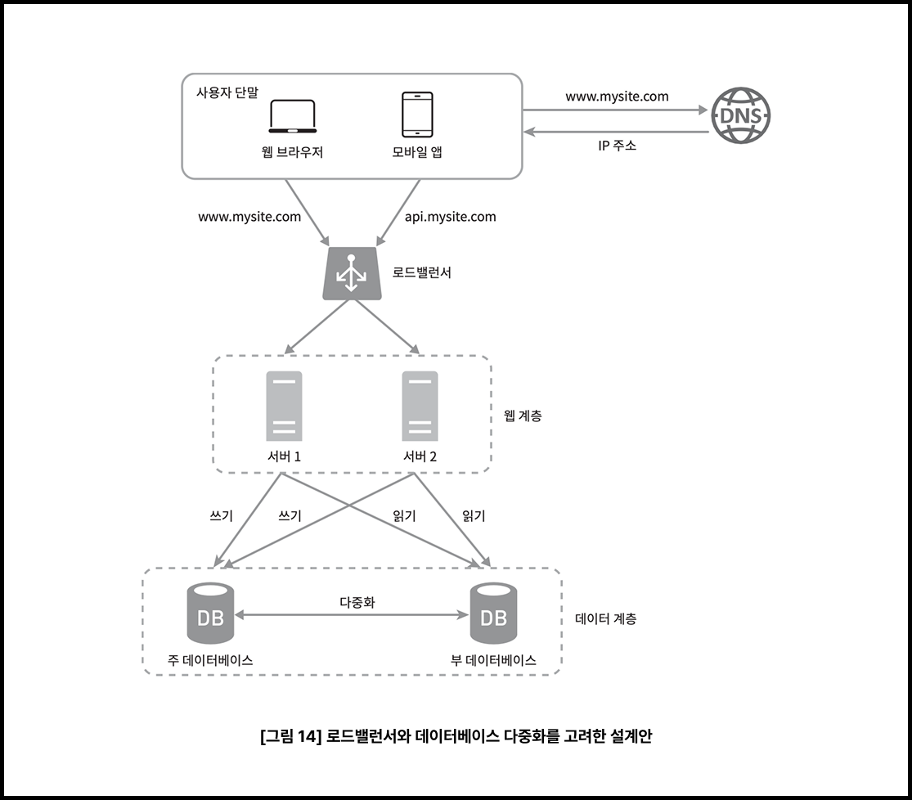

# 트래픽이 몰리면 시스템은 어떻게 진화해야 할까?

✅ [블로그 원문](https://coder-narak.tistory.com/58)으로 보시면 더욱 편합니다. 

## **0\. 트래픽 병목을 해결하는 9가지 구조적 해법**

트래픽은 한순간에 몰린다. 공지 하나, 이벤트 하나로 수만 명의 사용자가 동시에 접속하고, 시스템은 예고 없이 한계에 도달한다. 대부분의 장애는 “예상보다 빠르게” 발생한다. 그래서 트래픽은 터진 뒤에 대응하는 것이 아니라, 터지기 전에 설계로 준비해야 한다.  
  
문제는 “어디부터, 무엇을 바꿔야 하는가”다. 단순히 서버를 늘리는 것만으로는 해결되지 않는다. 시스템의 병목은 대개 하드웨어의 한계가 아니라, 구조의 제약에서 시작된다.  
  
서비스가 성장할수록 시스템은 단지 더 많은 요청을 처리하는 것뿐 아니라, 더 빠른 응답, 지속적인 가용성, 예상치 못한 부하에도 견디는 복원력까지 요구받는다. 따라서 시스템은 확장성(Scalability)만이 아니라, 가용성(Availability)과 성능 최적화(Performance)라는 세 가지 핵심 기준에 따라 구조적으로 진화해야 한다.  
  
이 글은 『가상 면접 사례로 배우는 대규모 시스템 설계 기초』 1장을 바탕으로, 트래픽 증가에 따라 시스템이 어떤 병목을 먼저 겪고, 어떤 순서로 구조를 바꿔나가야 하는지를 정리한다. 특히 뉴스피드 시스템이라는 예제를 통해, 단일 서버부터 로드밸런서, 캐시, CDN, 무상태 서버, 메시지 큐, 샤딩, 다중 데이터센터까지—실제 서비스가 어떤 의사결정 과정을 거치며 진화해왔는지를 구조적으로 짚어본다.

---

## **1\. 단일 서버: 시작은 단순했다**

대부분의 서비스는 단일 서버로 시작한다. 웹 서버, 데이터베이스, 캐시—all-in-one. 모든 구성 요소가 하나의 서버에 얹혀 있어 관리가 간편하고, 비용도 적게 든다. 사용자가 많지 않을 때는 이 구조로도 충분히 버틸 수 있다. 요청이 들어오면 서버는 HTML이나 JSON을 생성해 응답하고, 요청 수가 조금 늘어나도 스펙 좋은 서버 하나면 대응이 가능하다.

문제는 곧 드러난다. 트래픽이 조금만 더 늘어나면 CPU 사용률이 급격히 상승하고, 요청 처리 속도는 눈에 띄게 떨어진다. 특히 읽기와 쓰기 요청이 동시에 몰릴 경우, 처리 속도는 기하급수적으로 둔화된다. 데이터베이스까지 같은 서버에 함께 존재하면, 디스크 I/O 병목까지 발생해 상황은 더 나빠진다.

이 구조에서 나타나는 첫 번째 병목은 **리소스의 공유**다. CPU, 메모리, 디스크 입출력—all-in-one 서버 안에서 모든 자원이 함께 사용된다. 사용자가 늘어날수록, 자원에 대한 경쟁도 함께 늘어난다. 어느 순간부터는 웹페이지가 로딩되는 데 수 초가 걸리고, 데이터베이스 커넥션 풀이 모두 소진됐다는 에러 로그가 쌓이기 시작한다.

결국 선택지는 하나다. **역할을 나누는 것.** 웹 서버와 데이터베이스를 분리하면서, 시스템은 본격적인 구조 재편의 첫걸음을 내딛는다.

---

## **2\. 역할을 나누다: 웹 서버와 데이터베이스 분리**

단일 서버 구조에서 가장 먼저 나타나는 병목은 **연산과 저장이 한 시스템 안에서 경쟁**한다는 점이다. 웹 서버와 데이터베이스가 같은 CPU, 같은 메모리, 같은 디스크를 동시에 사용하는 구조다. 요청이 몰리면 웹 서버는 응답을 늦추고, 데이터베이스는 쿼리 처리 속도가 현저히 떨어진다.

이때 가장 먼저 하는 일은 **역할을 분리하는 것**이다. 웹 서버는 클라이언트의 요청을 받아 HTML이나 JSON을 만들어 응답하고, 데이터베이스는 쿼리를 받아 데이터를 읽고, 저장한다. 두 컴포넌트는 애초에 기능이 다르고, 요구하는 리소스 특성도 다르다. 그런데 단일 서버에서는 이 서로 다른 역할이 같은 자원을 두고 경쟁하게 된다. 트래픽이 늘어날수록 DB 처리 속도는 점점 느려지고, 그로 인해 웹 서버의 응답 지연도 함께 증가한다.

역할을 나누면 병목은 크게 줄어든다. 웹 서버는 요청 처리에만 집중하고, 데이터베이스는 쿼리 처리에 집중할 수 있다. 각각의 특성에 맞게 인프라를 독립적으로 확장하거나 조정할 수 있다. 예를 들어, 웹 서버는 트래픽 증가에 따라 여러 대로 늘릴 수 있고, 데이터베이스는 읽기 전용 복제본을 만들어 조회 부하를 분산하거나 캐시를 붙여 효율을 높일 수 있다.

이 구조는 명확한 진전이지만, 곧 새로운 병목이 나타난다. **웹 계층 자체가 트래픽을 감당하지 못하는 순간이 온다.** 데이터베이스는 버티고 있지만, 웹 서버 한 대는 한계에 다다른다. 다음 단계는 분명하다. **웹 서버의 수평 확장**이다.

---

## **3\. 수평 확장: 서버를 늘리는 것만으론 부족하다**

트래픽이 더 몰리면 웹 서버 한 대로는 감당이 안 된다. CPU는 이미 포화 상태고, 처리해야 할 요청은 계속 쌓인다. 이쯤 되면 대부분의 팀은 고민한다. **서버 성능을 끌어올릴 것인가, 아니면 서버 수를 늘릴 것인가.**

이때 흔히 비교하는 것이 수직 확장(Scale-up)과 수평 확장(Scale-out)이다. 수직 확장은 하나의 서버 스펙을 올리는 방식이다. 더 빠른 CPU, 더 많은 메모리, 더 빠른 SSD를 붙이면 일시적으로 성능은 개선된다. 하지만 이 방식에는 한계가 있다. 하드웨어의 성능에는 물리적 제한이 있고, 고사양 서버일수록 가격은 기하급수적으로 올라간다. 무엇보다 중요한 점은, **서버가 여전히 하나라는 사실은 변하지 않는다.** 장애가 발생하면 전체 서비스가 멈춘다. 단일 장애 지점(SPOF: Single Point of Failure)을 없애지 못한다는 점이 결정적이다.

그래서 일정 규모를 넘어서면 대부분의 시스템은 수평 확장을 택한다. 서버를 여러 대로 나누고, **트래픽을 분산 처리하는 구조**로 전환한다. 이때 핵심 역할을 하는 것이 로드밸런서(load balancer)다. 로드밸런서는 사용자 요청을 받아 여러 웹 서버로 나눠주는 역할을 한다. 라운드로빈, 최소 연결 수, 리스폰스 타임 기반 등 다양한 방식으로 분산 전략을 선택할 수 있지만, 핵심 목적은 하나다. **특정 서버에 부하가 몰려 병목이 발생하거나, 전체 서비스가 마비되는 것을 막는 것.**

웹 서버가 여러 대가 되면 복원력도 생긴다. 한 서버가 장애를 일으켜도, 나머지 서버가 요청을 계속 처리할 수 있다. 또한 **확장이 유연하다.** 트래픽이 늘어나면 서버를 추가하면 되고, 로드밸런서가 자동으로 분산 처리를 이어간다. 이 구조는 확장성(Scalability)과 가용성(Availability)을 동시에 끌어올릴 수 있다.

하지만 구조가 복잡해지는 만큼, 새로운 문제가 생긴다. 서버가 여러 대가 되면서 등장하는 질문은 이것이다: **“사용자 상태는 어디에 저장할 것인가?”**

예를 들어, 사용자가 A 서버에서 로그인한 상태인데 다음 요청이 B 서버로 전송되면, 그 서버는 해당 사용자의 세션 정보를 알 수 없다. 웹 서버마다 세션을 따로 관리하면 인증이나 설정 정보가 일관되지 않는다. 이 문제를 풀기 위해 시스템은 다음 단계로 진입한다. 바로, **무상태(stateless) 구조로의 전환**이다.

---

## **4\. 무상태 웹 서버: 상태를 버려야 확장할 수 있다**

웹 서버를 여러 대로 늘리면 확장은 쉬워진다. 하지만 구조가 복잡해지면서 **사용자 상태(session)** 문제가 드러나기 시작한다. 로그인 정보, 장바구니, 임시 설정값 같은 세션 데이터는 일반적으로 웹 서버의 메모리에 저장된다. 단일 서버 환경에서는 문제가 없다. 하지만 수평 확장을 통해 서버가 여러 대가 되면 이야기는 달라진다.

사용자가 A 서버에서 로그인한 뒤, 다음 요청이 B 서버로 전달되면 B 서버는 해당 사용자의 상태를 알 수 없다. 동일한 사용자임에도, **서버 입장에서는 ‘처음 본 요청’처럼 보이는 현상**이 발생한다.

이 문제를 해결하는 방법은 두 가지가 있다. 첫 번째는 **sticky session**이다. 한 번 연결된 사용자는 이후에도 동일한 서버로 요청을 보내도록 로드밸런서가 고정 라우팅하는 방식이다. 하지만 이 방식은 유연성이 떨어진다. 서버 추가나 교체가 어렵고, 장애 발생 시 복원도 복잡해진다. 로드밸런서의 부담이 커지고, 특정 서버에 트래픽이 집중되면 병목이 생기기 쉽다.

보다 근본적인 해결책은 **무상태(stateless) 아키텍처**다. 서버가 사용자 상태를 관리하지 않고, 세션 정보를 외부 저장소(Redis, Memcached, 데이터베이스 등)에 저장한다. 이 방식에서는 어떤 서버가 요청을 받아도 동일한 저장소에서 상태를 조회할 수 있으므로, **모든 서버가 교체 가능하고 확장 가능한 상태**가 된다.

무상태 구조로 전환하면 수평 확장은 물론, 오토스케일링(자동 확장)도 자연스럽게 작동한다. 서버를 추가하거나 제거할 때 별도의 세션 마이그레이션이 필요 없다. 모든 상태는 서버 바깥에 있기 때문에, **서버는 요청을 받아 처리하고 응답만 반환하는 순수한 처리 단위**로 작동한다. **이 단순함이 바로 확장의 기반이 된다.**

하지만 구조를 단순하게 만든다고 해서 트래픽 자체가 줄어드는 것은 아니다. 오히려 사용자가 늘고, 요청이 몰리면 시스템은 더 빠른 응답을 요구받는다. 다음 단계는 **성능 최적화**다. 자주 쓰는 데이터를 미리 준비해두는 구조, 즉 캐시(Cache)와 콘텐츠 전송 네트워크(CDN)가 필요해진다.

---

## **5\. 캐시와 CDN: 데이터를 더 빨리, 더 가까이에서**

웹 서버를 늘리고, 사용자 상태를 서버 외부로 분리했다고 해서 모든 문제가 해결되는 것은 아니다. 사용자가 많아질수록, 그리고 사용자 기대치가 높아질수록 시스템은 단순히 ‘버티는 것’을 넘어서, **더 빠르게 응답하는 구조**를 요구받는다. 이때 필요한 것이 캐시(Cache)다.

캐시는 자주 요청되는 데이터를 미리 저장해두는 저장소다. 일반적으로 Redis나 Memcached 같은 **메모리 기반 인메모리 데이터베이스**를 사용해 응답 속도를 높인다. 예를 들어 뉴스피드 서비스라면, 사용자가 앱을 열 때마다 매번 DB에서 최신 글을 쿼리하지 않고, **미리 계산해 둔 피드를 캐시에 저장**해 빠르게 응답할 수 있다. 이는 데이터베이스 부하를 줄이고, 전체 시스템의 응답 성능을 비약적으로 개선한다.

캐시는 어디에 두느냐에 따라 효과가 달라진다. 웹 서버 내부 또는 앞단에 두어 계산 결과를 바로 반환할 수도 있고, 클라이언트 요청 경로 중간(API Gateway 등)에 배치해 병목을 최소화할 수도 있다. 캐시 전략도 상황에 따라 다르다:

-   **read-through**: 캐시가 DB를 대신해서 데이터를 로드
-   **write-through**: 데이터를 캐시와 DB에 동시에 기록
-   **write-around**: 캐시를 우회해서 DB에만 직접 기록

이처럼 캐시 전략은 데이터 특성과 **일관성 요구 수준**에 따라 선택되어야 한다. 중요한 점은, 이 구조 없이 트래픽이 몰리면 **가장 먼저 무너지는 곳은 항상 데이터베이스**라는 것이다.

그리고 캐시로도 부족할 때, 더 앞단에서 정적 자산을 처리하는 방식이 필요하다. 그 역할을 하는 것이 바로 CDN(Content Delivery Network)이다.

CDN은 이미지, CSS, JS 파일처럼 자주 변경되지 않는 정적 자산을 사용자에게 **가장 가까운 위치의 엣지 서버**에 저장하고 제공한다. 사용자가 웹페이지를 열면 원본 서버까지 도달하지 않고도 근처 CDN 서버에서 자산을 받아올 수 있다. 이는 네트워크 레이턴시를 줄이고, 웹 서비스 체감 속도를 크게 개선한다. 

요약하자면, 캐시는 ‘계산된 결과’를 빠르게 전달하는 장치이고, CDN은 ‘정적 파일’을 더 빠르게 제공하는 인프라다. 둘 다 궁극적으로는 **응답 속도를 단축하고 서버 부담을 줄이기 위한 계층적 최적화 전략**이다.

물론 이 구조에도 새로운 고민은 생긴다. **캐시는 언제 만료시켜야 할까?** **데이터가 변경됐을 때 어떻게 일관성을 유지할까?** 캐시를 붙이는 순간부터 시스템은 **속도와 정확성 사이의 균형**을 끊임없이 고민하게 된다. 그리고 이 균형은 트래픽이 몰리는 순간, 가장 먼저 시험대에 오른다.

이제 다음 단계는 속도를 넘어서, **절대 멈추지 않는 시스템**을 만드는 일이다. 장애를 견디는 구조, 즉 **데이터 복제, 다중화, 그리고 다중 데이터센터 구성**이 필요해진다.

---

## **6\. 멈추지 않는 시스템을 위한 설계: 복제와 다중화**

트래픽이 몰리면 서버는 느려지고, 때로는 멈춘다. 아무리 빠른 시스템이라도, 멈추는 순간 사용자에게는 ‘실패한 서비스’로 인식된다. 그래서 일정 규모를 넘어서면, 속도보다 중요한 목표는 가용성(Availability)이다. 시스템은 빠르게 응답해야 할 뿐 아니라, **언제나 응답할 수 있어야 한다.**

이를 위해 가장 먼저 시도하는 구조가 데이터베이스 복제(replication)다. 단일 DB는 구조적으로 위험하다. 장애가 발생하면 수 분, 혹은 수십 분 내내 서비스가 중단될 수 있다. 이를 막기 위해 데이터를 실시간으로 다른 서버에 복제해 두고, 리더-팔로워 구조(혹은 마스터-슬레이브 구조)를 구성한다.

이 구조에서 쓰기 요청은 리더(또는 마스터)가 전담하고, 읽기 요청은 복제본(팔로워 또는 슬레이브)이 처리한다. 이렇게 역할을 분산하면, 읽기 부하를 나눌 수 있을 뿐 아니라, 장애 발생 시 읽기 전용 서비스라도 계속 제공할 수 있는 복원력이 생긴다.

하지만 이 방식에도 한계는 있다. 장애가 단순히 서버 한 대가 아니라 **물리적 데이터센터 전체에서 발생한다면** 이야기는 달라진다. 아무리 서버가 많아도 한 장소에 모여 있다면 모두 함께 멈출 수 있다. 그래서 다음 단계는 다중 데이터센터 구성(Multi-data Center Architecture)이다.

지역별로 물리적으로 분리된 인프라를 구성하고, 사용자의 위치에 따라 **트래픽을 분산 처리**한다. 이를 위해 **GeoDNS**나 **Anycast IP**, 혹은 글로벌 로드밸런서를 사용한다. 이 구조에서는 사용자가 가장 가까운 데이터센터에서 응답을 받아 네트워크 지연을 줄일 수 있고, 한 지역에 장애가 발생하더라도 다른 지역이 즉시 백업을 맡을 수 있다.

이 시점부터는 단순한 시스템 운영이 아니다. **서버가 언제든 죽을 수 있다는 전제 아래, 시스템이 멈추지 않도록 설계**해야 한다. 무중단 장애 복구(Failover), 장애 전파 최소화(Isolation), 자동 전환(Automatic Switchover) 등 장애를 견디는 시스템 설계(Resilient Architecture)가 중심 과제가 된다.

이제, 시스템은 어느 정도 **‘멈추지 않을 준비’를 갖춘 상태**다. 다음 과제는 성능도, 복원력도 아닌 **쓰기 트래픽의 제어**다. 대규모 쓰기 요청은 순간적으로 시스템 전체를 압도할 수 있다. 이를 분리하고 완충하기 위해 등장하는 구조가 바로 메시지 큐(Message Queue)다.

---

## **7\. 메시지 큐: 한꺼번에 몰리는 쓰기를 버퍼링하다**

시스템이 어느 정도 안정적으로 읽기 요청을 처리하게 되면, 다음으로 문제가 되는 건 **쓰기(write) 요청**이다. 새로운 게시물 작성, 댓글 달기, 좋아요, 푸시 전송, 피드 갱신 같은 쓰기 작업은 단순해 보이지만 실제로는 **여러 컴포넌트를 동시에 건드리는 연쇄 작업**이다. DB 저장, 캐시 무효화, 사용자 알림, 피드 재계산 등 다양한 후속 프로세스가 연결된다.

이러한 쓰기 요청이 **실시간으로 동시에 몰리면**, 시스템은 과부하에 빠진다. DB는 쓰기 충돌로 인해 병목이 발생하고, API 서버는 처리 지연으로 타임아웃이 속출한다. 특히 이벤트성 트래픽—예를 들어 특정 연예인의 게시물이 올라온 직후 댓글이 폭주하는 경우—에는 이 문제가 더욱 두드러진다.

이때 필요한 것은 **모든 작업을 즉시 처리하지 않는 구조**, 즉 **비동기 처리 방식**이다. 그리고 그 중심에 있는 것이 메시지 큐(Message Queue)다.

메시지 큐는 요청이 들어오면 바로 처리하지 않고, 일단 **큐에 저장한 뒤 순차적으로 처리하는 구조**다. 예를 들어 사용자가 게시글을 작성하면, 글 저장은 바로 처리하되, 피드 갱신이나 알림 전송 등 부가 작업은 메시지 큐에 태운다. 이후 워커(Consumer)가 큐에 쌓인 메시지를 하나씩 꺼내 백그라운드에서 처리한다.

이 구조 덕분에 서버는 **사용자에게 빠르게 응답**할 수 있고, 동시에 **후속 작업은 서버 부담 없이 천천히 처리**할 수 있다. 급격한 쓰기 트래픽이 몰려도, 시스템은 ‘쌓아두고 천천히 처리하는’ 버퍼링 구조로 안정성을 확보할 수 있다. 이것이 메시지 큐의 핵심 가치다.

뉴스피드 시스템에서도 마찬가지다. 팔로우한 친구가 글을 쓰면, 그 피드를 수천 명의 사용자에게 즉시 반영하려고 하면 서버는 버티지 못한다. 대신 “누가 글을 썼다”는 정보를 메시지 큐에 태우고, 전용 워커가 이를 받아 **피드를 계산한 뒤 캐시에 미리 저장**하는 구조를 사용한다.

이 방식 덕분에 뉴스피드 서비스는 실시간성과 안정성을 모두 확보할 수 있다.

단, 메시지 큐는 단순히 “느린 작업을 미루는 도구”로만 봐서는 안 된다. **큐가 병목이 되면 전체 처리 속도도 늦어진다.** 또한 실패한 메시지를 어떻게 복구할지, 재처리 로직(dead-letter queue 등)은 어떻게 설계할지 등 **비동기 시스템 특유의 복잡성을 반드시 고려해야 한다.** 비동기는 유연하지만, 그만큼 **설계는 단단해야 한다.**

이제 시스템은 확장할 수 있고, 멈추지 않고, 급격한 쓰기 트래픽도 흘려보낼 수 있다. 이제 마지막 과제는, 이 모든 구조를 **운영 가능한 형태로 유지**하는 일이다. 설계는 끝났고, 이제부터는 **운영이 시스템의 품질을 결정한다.**

---

## **8. 로그, 메트릭, 자동화: 구조보다 운영이 시스템을 지탱한다**

아무리 잘 설계된 시스템도, **운영이 받쳐주지 않으면 오래가지 못한다.** 서버는 예고 없이 느려지고, 트래픽은 갑작스럽게 쏠리고, 사용자는 불편함을 겪지만, 그 신호는 종종 **로그에 가장 먼저 나타난다.** 시스템이 복잡해질수록 중요한 건, **문제를 빠르게 감지하고, 원인을 신속히 좁히는 능력**이다. 이제부터는 ‘설계’보다 ‘운영’이 시스템의 품질을 결정한다.

가장 기초적인 관찰 도구는 로그(log)다. 에러 로그는 문제가 발생했다는 신호를 주고, 액세스 로그는 사용자의 행동 패턴을 기록하며, 애플리케이션 로그는 내부 처리 흐름을 확인할 수 있게 한다. 하지만 로그는 수동적이다. **문제를 ‘발견’하는 주체는 사람이고, 대응 속도는 느리다.**

그래서 필요한 것이 메트릭(metrics)이다. 메트릭은 시스템의 상태를 수치로 표현한다. CPU 사용률, 메모리 사용량, 요청 처리 시간, 데이터베이스 쿼리 지연, 메시지 큐의 backlog 길이 같은 지표를 실시간으로 수집하고, **사전에 정의한 임계값(threshold)에 도달하면 경고(Alert)를 발생시킨다.**

예: “DB 쓰기 실패가 평소보다 2배 이상 늘었다”, “평균 응답 속도가 기준치를 초과했다”

이러한 정량적 기준은 **문제를 사전에 감지하고, 즉시 대응할 수 있게 해준다.**

마지막으로 여기에 자동화(automation)가 붙는다. 운영자가 일일이 지켜보지 않아도, 시스템이 **스스로 판단하고 반응**하는 구조다.

예를 들어:

-   CPU 사용률이 급증하면 서버 인스턴스를 자동으로 하나 더 띄운다
-   메시지 큐 backlog가 일정 길이를 넘으면 워커 수를 늘린다
-   신규 배포 후 에러율이 급격히 증가하면 자동 롤백한다

이러한 자동화는 단순한 편의 기능이 아니라, **운영의 일관성과 신뢰성을 유지하는 필수 장치**다. 사람이 놓치는 순간에도, 시스템은 ‘일관되게 반응할 수 있는 상태’를 유지해야 한다.

운영이 잘되는 시스템은 눈에 띄지 않는다. 로그는 조용히 쌓이고, 메트릭은 안정적으로 흐르며, 자동화는 묵묵히 기능한다. 그 상태가 유지되는 한, 트래픽이 폭주해도 시스템은 무너지지 않는다.

하지만 아직 하나가 남아 있다. **데이터 그 자체**다. 아무리 구조가 좋아도, 최종 병목은 항상 데이터베이스에서 발생한다. 시스템의 마지막 과제는 데이터 계층을 수평으로 분산하는 것, 즉 샤딩(Sharding)이다.

---

## **9. 샤딩: 하나의 데이터베이스로는 끝까지 못 간다**

서비스가 커지고 사용자 수가 많아질수록, 마지막까지 남는 병목은 결국 **데이터베이스**다. 쓰기 부하는 캐시나 메시지 큐로 어느 정도 완충할 수 있고, 읽기 부하는 리더-리플리카 구조로 분산할 수 있다. 하지만 **쓰기 요청은 여전히 단일 DB에 집중된다.**

이 구조는 일정 시점 이후 한계를 드러낸다. 테이블은 점점 커지고, 인덱스 성능은 느려지며, 복제 지연(replication lag)은 점차 누적된다. 결국 데이터베이스 한 대가 감당할 수 있는 쓰기 처리량은 **물리적·논리적 한계**에 도달한다.

이때 꺼내는 최후의 수단이 샤딩(Sharding)이다. 샤딩은 하나의 데이터베이스를 **물리적으로 나누는 구조적 전략**이다. 보통 유저 ID, 지역, 해시값 등 특정 키를 기준으로 데이터를 나눠, 각기 다른 DB 인스턴스에 분산 저장한다.

예: 유저 ID 11,000만은 DB1, 1,000만 2,000만은 DB2에 저장하는 식이다.

이렇게 하면 **데이터의 저장 공간과 쓰기 부하를 수평적으로 확장**할 수 있다.

하지만 샤딩은 단순히 데이터를 나눈다고 끝나지 않는다. 먼저 중요한 것은 **샤딩 키를 무엇으로 설정할지**다. 유저 수 기준으로 나누면 설계는 단순하지만, 특정 사용자(예: 팔로워 수가 많은 ‘셀럽 유저’)에게 트래픽이 몰리면 **일부 샤드에만 부하가 집중되는 불균형**이 발생한다. 이른바 **celebrity problem**이다.

또한 샤드 개수가 고정돼 있으면, 서비스가 더 커졌을 때 **샤드를 늘리기 위한 데이터 재분배**, **다운타임**, **이중 쓰기**, **마이그레이션 오류** 같은 문제가 발생할 수 있다. 이를 해결하기 위해 **가상 샤드(Virtual Shard)**, **동적 샤딩(Dynamic Partitioning)**, **Consistent Hashing** 같은 기법이 활용된다.

샤딩은 강력한 확장 전략이지만, 동시에 **복잡한 운영의 시작**이기도 하다. 샤딩된 구조에서는:

-   쿼리 라우팅 로직이 추가로 필요하고
-   장애 복구 전략도 샤드별로 별도 설계해야 하며
-   백업과 마이그레이션, 테스트 환경 구성 등도 훨씬 복잡해진다.

요컨대, 샤딩은 시스템 설계의 끝이 아니라, **또 다른 운영 전략의 시작점**이다. 이제 시스템은 단일 서버에서 출발해 로드밸런서, 캐시, CDN, 무상태 아키텍처, 메시지 큐, 데이터 복제, 다중 데이터센터, 그리고 샤딩까지 도달했다. **이 모든 구조는 트래픽을 견디고, 확장하며, 멈추지 않기 위한 설계적 선택의 결과다.** 이제 마지막으로, 이 복잡한 진화 과정을 한 줄로 정리해보자.

---

## **10\. 백만 사용자, 그리고 그 이상: 시스템은 어떻게 진화해왔는가**

서비스는 **단일 서버**에서 출발했다. 웹 서버와 데이터베이스가 한 시스템에 공존했고, 초기에는 그것만으로 충분했다.

곧 **역할을 분리**해 웹 서버와 DB를 나누고, **수평 확장**을 통해 웹 서버를 여러 대로 늘렸다. 트래픽이 증가하자 **캐시**를 도입해 응답 속도를 높였고, **CDN**을 통해 정적 자산을 사용자 가까이에서 제공했다. **무상태 아키텍처**로 서버를 단순화해 확장성과 장애 복원력을 확보했고, **DB 복제**와 **다중 데이터센터** 구성을 통해 가용성을 높였다. **쓰기 요청은 메시지 큐**로 분리해 버퍼링하고, 마지막엔 **샤딩**으로 데이터 저장 자체를 수평 확장했다.

이 흐름은 단순한 성능 향상이 아니라, **트래픽 증가에 따라 시스템이 감당해야 할 요구를 구조적으로 해석하고,** **그에 맞는 설계를 단계적으로 적용한 결과**였다. **성장은 복잡성을 낳고, 복잡성은 결국 설계로 풀어야 한다.**

모든 구조에는 이유가 있다. 뉴스피드처럼 단순해 보이는 기능조차, 그 이면에는 수많은 **설계적 판단과 기술적 절충**이 존재한다. 무엇을 미리 준비해둘 것인지, 장애를 어떻게 견딜 것인지, 데이터를 어디까지 나눌 수 있을지— 이 모든 선택이 서비스의 확장성과 생존력을 결정한다.

**트래픽은 언제든 몰릴 수 있다.** 잘 설계된 시스템은, 그 순간에 무너지지 않는다. **오히려 그 순간을 통해 진화한다.**

---

## **부록: 뉴스피드 시스템은 이렇게 진화한다**

뉴스피드처럼 읽기 요청이 집중되는 서비스는 트래픽 증가에 특히 민감하게 반응한다. 겉보기엔 단순한 기능처럼 보이지만, 그 뒤에서 움직이는 시스템 구조는 복잡하다. 지금까지 설명한 시스템 진화의 흐름은 뉴스피드 시스템에서도 그대로 적용된다.

**1\. 단일 서버**

초기에는 모든 사용자의 피드를 데이터베이스에서 직접 읽어와 웹 서버가 곧바로 응답한다. 팔로우 글을 실시간으로 반영하지 않고, 앱 접속 시마다 피드를 조회한다. → 소규모 트래픽에선 충분히 작동한다.

**2\. 웹/DB 분리**

피드 조회 요청이 많아지면서 웹 서버와 DB 모두 병목을 겪는다. DB는 읽기 전용으로 분리되거나, 피드만 담당하는 테이블로 분산 설계된다.

**3\. 수평 확장 & 로드밸런서**

유저 수가 증가하고, 앱 진입 시 피드 호출이 몰리는 구조에서 단일 웹 서버는 버티지 못한다. 로드밸런서를 도입해 요청을 여러 서버로 분산 처리한다.

**4\. 무상태 웹 서버**

사용자 세션은 Redis와 같은 외부 저장소에 유지하고, 웹 서버는 Stateless하게 구성해 어떤 서버가 요청을 받아도 일관된 상태를 제공할 수 있도록 설계한다.

**5\. 캐시 & CDN**

자주 호출되는 피드는 미리 계산해 캐시에 저장하고, 글이 새로 등록되면 DB와 캐시를 함께 갱신한다. 이미지·동영상·썸네일 등 정적 자산은 CDN으로 제공해 글로벌 사용자에게 더 빠른 응답을 제공한다.

**6\. 다중화 & 데이터센터 분산**

CDN이나 DB에 장애가 생겨도 전체 서비스가 멈추지 않도록 GeoDNS 기반으로 여러 지역에 데이터센터를 구성하고, 각 지역에서 독립적으로 피드를 처리하도록 설계한다.

**7\. 메시지 큐**

팔로우한 유저가 새 글을 쓰면, 해당 피드를 모든 팔로워에게 반영해야 한다. 이 작업을 실시간으로 처리하지 않고, ‘새 글 등록’ 이벤트를 메시지 큐에 넣고, 워커가 순차적으로 처리한다. → 대규모 쓰기 트래픽에 대한 버퍼링 구조

**8\. 로그 & 메트릭**

피드 조회 속도, 캐시 히트율, 큐 backlog, 특정 계정의 트래픽 등을 지표로 수집해 이상 징후를 조기에 탐지하고 대응한다.

**9\. 샤딩**

피드 테이블은 유저 ID 기준으로 샤딩되어 분산 저장된다. 셀럽 계정처럼 팔로워 수가 많은 경우엔 별도 샤드로 분리해 부하를 최소화한다. → celebrity problem 회피

**10\. 자동화**

피드 생성이 지연되면 자동으로 알림을 보내고 큐 워커를 확장하거나, 특정 샤드의 오류율이 높아지면 자동 failover가 실행된다.

**뉴스피드는 단순한 리스트가 아니다.** 그 안에는 시스템 구조의 거의 모든 요소가 들어 있다. **뉴스피드를 설계할 수 있다면,** **대부분의 서비스에서 발생하는 트래픽 문제를 설계로 해결할 수 있다.**
