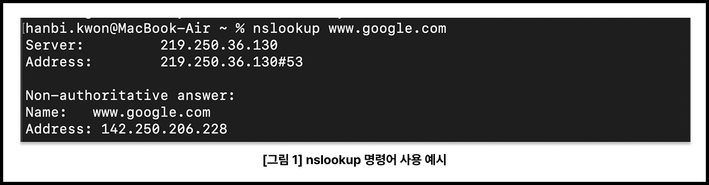
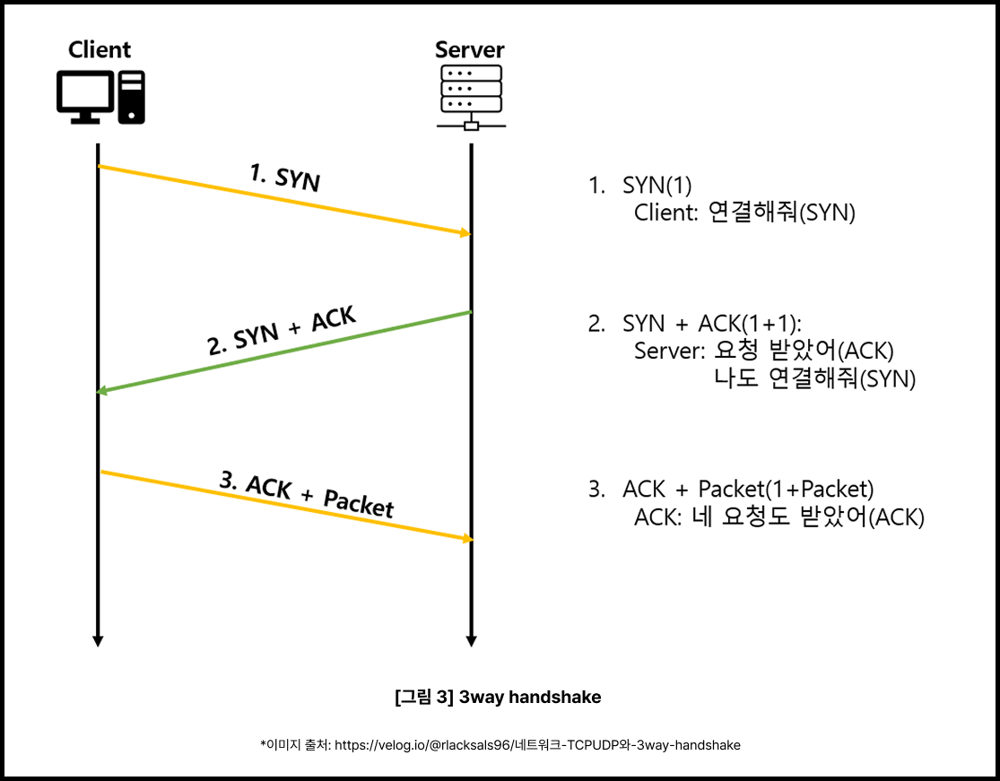
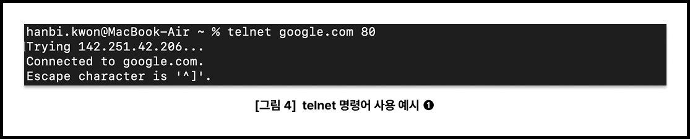
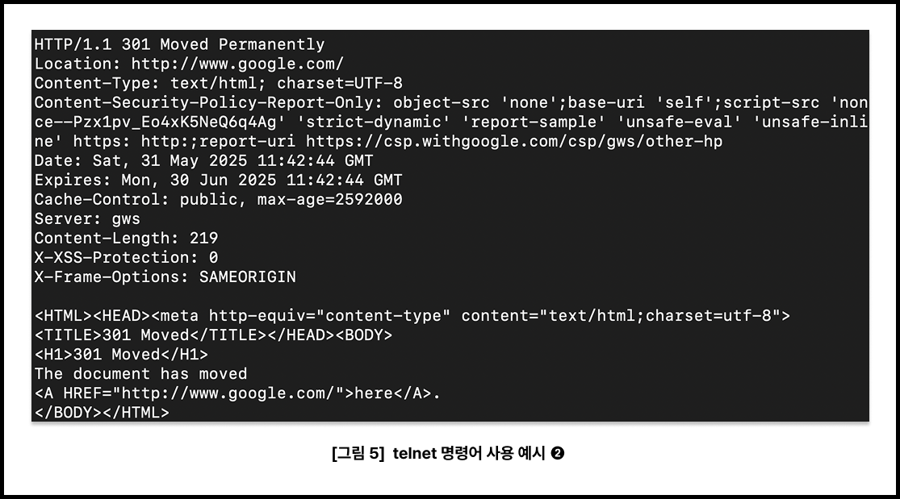
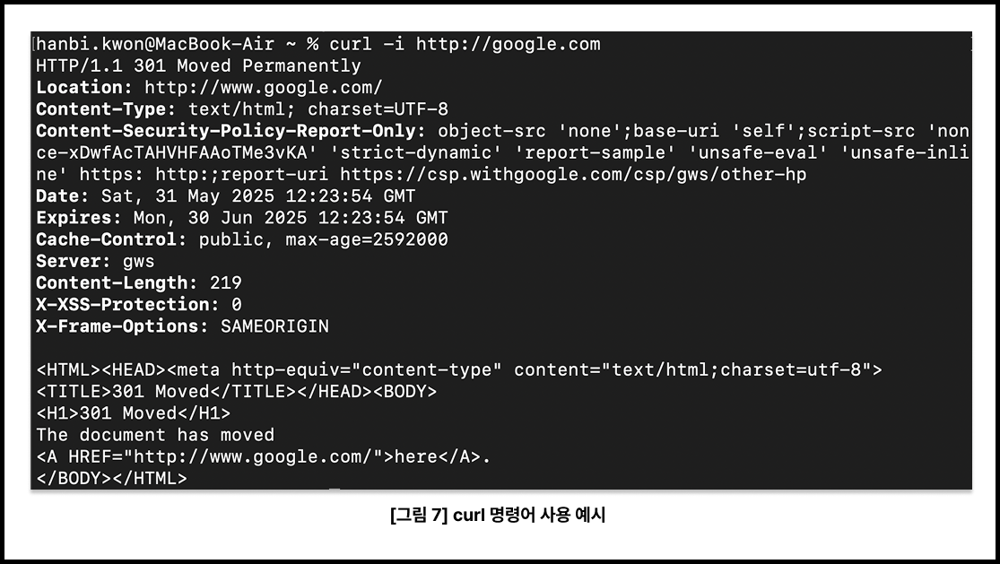
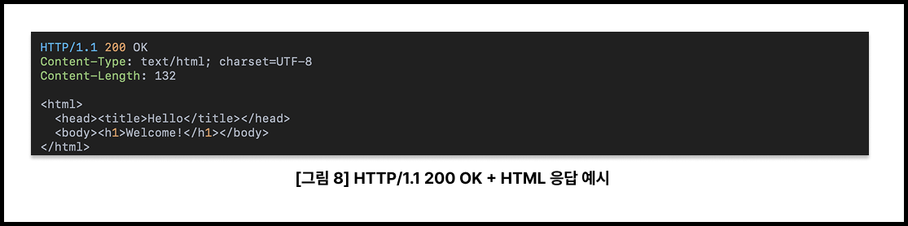
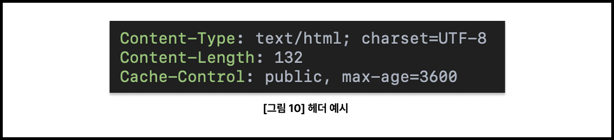
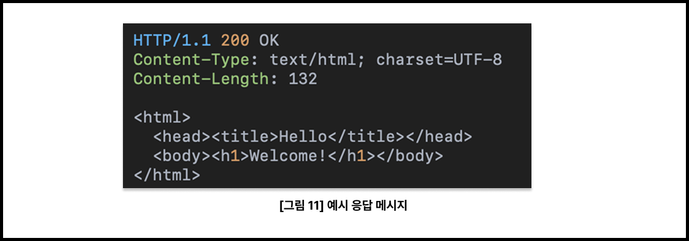
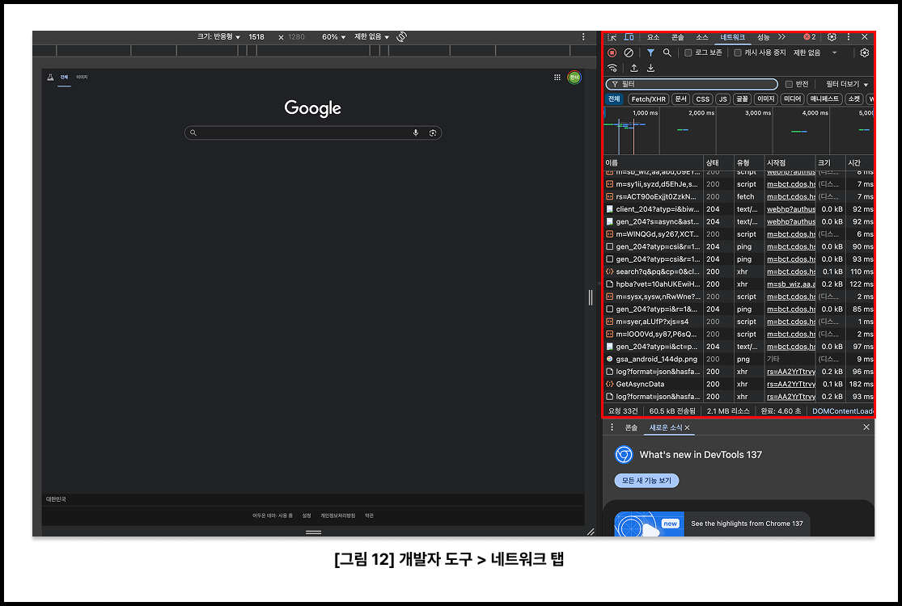
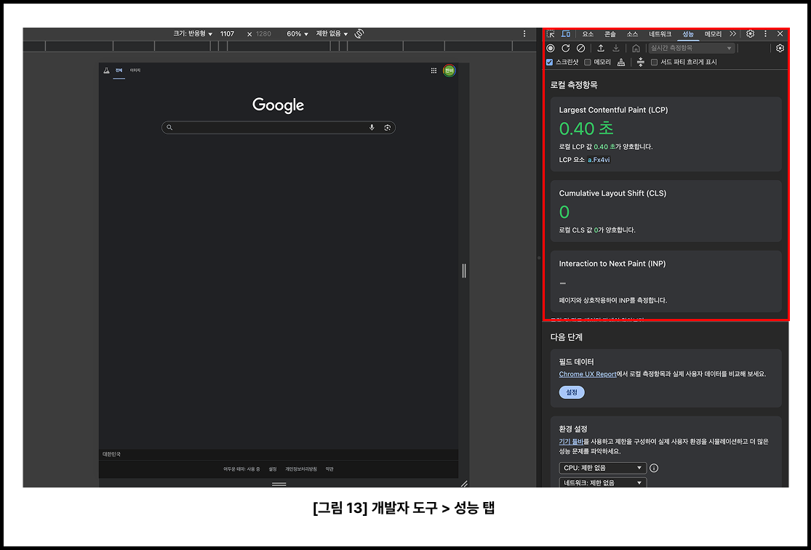

# 주소창에 URL을 입력하면 어떤 일이 일어날까?

✅ [블로그 원문](https://coder-narak.tistory.com/59)으로 보시면 더욱 편합니다. 


> 우리는 매일 브라우저에 URL을 입력하고, 익숙하게 웹페이지를 마주합니다. 하지만 그 짧은 순간 동안, 컴퓨터와 인터넷 너머에서는 여러 기술이 유기적으로 작동하고 있습니다. 이 글은 그 과정을 단계별로 차근차근 짚어보려 합니다. 도메인 이름을 IP 주소로 바꾸는 일(DNS)부터, 서버와의 연결(TCP), 요청과 응답이 오가는 방식(HTTP), 그리고 브라우저가 화면을 그리는 과정까지 함께 따라가봅니다.

## **1\. 브라우저 주소창에** **www.example.com** **입력**

브라우저에 `http://www.example.com`을 입력하고 엔터를 누르면, 웹 요청이 시작된다. 이 단순한 동작은 웹의 작동 원리를 이해하는 첫 단서다. 요청은 이 한 줄의 문자열에서 출발하지만, 그 안에는 서버와 통신하기 위한 핵심 정보들이 담겨 있다.

#### **URL은 어떻게 구성되어 있을까?**

입력한 주소는 브라우저가 해석할 수 있는 URL(Uniform Resource Locator) 형식으로 변환된다. 아래는 일반적인 URL의 구조다. 

```
https://www.example.com:443/path/to/resource?key=value#section
```

| **구성 요소** | **설명** |
| --- | --- |
| https | 스킴(Scheme) – 사용할 프로토콜 결정 |
| www.example.com | 호스트(Host) – 요청 대상 서버의 도메인 |
| :443 | 포트(Port) – 통신에 사용할 포트 번호 |
| /path/... | 경로(Path) – 요청할 리소스의 위치 |
| ?key=value | 쿼리(Query) – 요청에 포함할 파라미터 |
| #section | 프래그먼트(Fragment) – 문서 내 특정 위치 |

브라우저는 이 정보를 해석해 요청에 필요한 모든 설정을 자동으로 준비한다. 사용자는 URL을 입력했을 뿐이지만, 이 단계에서 요청 흐름의 윤곽이 결정된다. 

#### **입력과 동시에 시작되는 작업들**

브라우저는 URL 해석을 마치면 다음과 같은 작업을 순차적으로 수행한다.

1.  DNS 조회 – 도메인 이름을 IP 주소로 변환
2.  TCP 연결 – 대상 서버와 3-way handshake를 통해 연결
3.  HTTP 요청 전송 – 준비된 요청을 서버로 보냄

이 모든 과정은 눈 깜짝할 사이에 이루어진다. 하지만 각각의 단계는 명확한 역할과 규칙을 가지고 있으며, 문제 해결이나 성능 개선을 위해 반드시 이해하고 있어야 한다. 

#### **\[ 📌** **더 알아보기 \] URL과 URI의 차이**

URL은 우리가 흔히 사용하는 웹 주소를 말한다. 하지만 정확하게는 URI(Uniform Resource Identifier)의 하위 개념이다.

-   URI는 리소스를 식별하는 모든 문자열을 말한다. URL, URN을 포함한다.
-   URL은 그중에서도 리소스의 위치(주소)를 명시한다. 대부분의 웹 주소가 여기에 해당한다.
-   URN은 리소스의 이름만 식별한다. 예: urn:isbn:9780131103627

예를 들어, `https://www.example.com/index.html`은 URL이자 URI이며, urn:isbn:978-3-16-148410-0은 URI이지만 URL은 아니다. 즉, URL은 URI의 한 종류다. 실무에서는 구분하지 않고 쓰는 경우도 많지만, 기술적으로는 구별할 수 있다면 더 정확하다.

---

## **2\. DNS – 도메인 이름을 IP 주소로 바꾸다**

www.example.com이라는 주소는 사람이 읽기 쉽도록 만들어진 이름이다. 하지만 컴퓨터는 이런 문자열을 이해하지 못한다. 실제로 서버에 요청을 보내기 위해서는 숫자로 된 IP 주소가 필요하다. 따라서 브라우저가 가장 먼저 수행하는 일은, 입력한 도메인을 IP 주소로 바꾸는 작업, 즉 DNS(Domain Name System) 조회다. 

#### **도메인 이름과 IP 주소**

도메인과 IP 주소의 관계는 전화번호부에 비유할 수 있다. 도메인 이름은 사람 이름, IP 주소는 전화번호에 해당한다. 전화번호를 외우기 어려우니 이름으로 저장하듯, IP 대신 도메인을 사용하는 셈이다.

-   www.example.com → 93.184.216.34
-   google.com → 142.250.206.14

웹 브라우저는 먼저 도메인을 기반으로 IP 주소를 찾은 다음, 해당 주소로 실제 통신을 시도한다.

#### **DNS 조회는 어떤 순서로 이루어질까?**

DNS 조회는 성능을 고려해 여러 단계를 거치며, 캐시를 적극 활용한다.

1.  **브라우저 캐시:** 브라우저가 이전 요청에서 IP 정보를 저장하고 있다면, 가장 먼저 이를 사용한다.
2.  **운영체제(OS) 캐시:** 브라우저에 정보가 없으면, 운영체제가 가지고 있는 DNS 캐시를 확인한다.
3.  **호스트 파일:** 일부 시스템은 /etc/hosts(Unix) 또는 C:\\Windows\\System32\\drivers\\etc\\hosts(Windows) 파일에서 도메인-IP 매핑을 직접 설정할 수 있다.
4.  **로컬 DNS 서버(주로 공유기나 ISP):** 캐시에 정보가 없으면, 네트워크에 설정된 DNS 서버로 쿼리를 보낸다.
5.  **권한 있는 네임서버까지 순차적 조회:** 최종적으로, 루트 → TLD → 권한 있는 네임서버로 이어지는 계층적 구조를 따라가며 IP 주소를 찾는다.

이 과정을 통해 브라우저는 www.example.com이 실제로 어떤 IP 주소를 가지고 있는지를 알아낸다.  

#### **\[ 📌 실습 \] 도메인 이름의 IP 주소 확인하기**

**nslookup 명령어**

사용 중인 DNS 서버와, 해당 도메인의 IP 주소를 확인할 수 있다.

```
nslookup www.example.com
```



-   Server: 현재 설정된 DNS 서버
-   Address: 조회 결과로 받은 IP 주소

**dig 명령어 (Unix/macOS/Linux)**

DNS 질의에 대한 자세한 정보를 확인할 수 있다.  TTL(Time To Live), 응답 시간, 네임서버 정보 등을 함께 확인할 수 있어 디버깅에 유용하다.

```
dig www.example.com
```


-   QUESTION SECTION: 질의한 도메인과 타입
-   ANSWER SECTION: 응답 IP 주소와 TTL(Time To Live)
-   IN A: IPv4 주소를 요청한 것

---

## **3\. TCP 연결 – 손잡고 대화할 준비**

브라우저가 도메인의 IP 주소를 알아낸 뒤, 서버와 실제로 통신하기 위해서는 먼저 TCP 연결을 맺어야 한다. 이 과정은 HTTP 요청을 전송하기 전에 반드시 필요한 절차이며, 데이터를 신뢰성 있게 주고받기 위한 준비 단계다. 

#### **왜 TCP 연결이 필요한가?**

HTTP는 TCP 위에서 동작하는 애플리케이션 계층 프로토콜이다. HTTP 자체는 연결을 유지하거나, 데이터의 손실 여부를 확인하지 않는다. 대신, 이러한 기능은 **전송 계층인 TCP가 담당한다.** TCP는 데이터가 **순서대로, 빠짐없이, 손상 없이** 전달되도록 보장하며, 이를 위해 먼저 **3-way Handshake** 과정을 거쳐 연결을 수립한다.

#### **3-way Handshake란?**




TCP 연결은 다음 세 단계로 시작된다.

1.  SYN – 클라이언트가 서버에 연결 요청을 보낸다.
2.  SYN-ACK – 서버가 요청을 수락하고 응답을 보낸다.
3.  ACK – 클라이언트가 응답을 확인하고 연결 완료를 알린다.

이 과정을 통해 서로 연결 의사를 확인하고, 이후의 데이터 전송은 이 연결을 기반으로 이루어진다.

#### **\[ 📌** **더 알아보기 \]** **SYN/ACK는 실제로 어떻게 전송될까?**

TCP 연결 과정에서 등장하는 SYN, ACK, FIN 같은 키워드는 단지 개념이 아니라, 실제 패킷의 특정 비트로 설정되어 전송된다. TCP 헤더에는 6개의 플래그 비트가 존재한다:

| **플래그** | **의미** | **예시** |
| --- | --- | --- |
| SYN | 연결 시작 요청 | 0x02 |
| ACK | 응답 확인 | 0x10 |
| SYN + ACK | 연결 수락 응답 | 0x12 |

이 값들은 TCP 헤더 내에서 이진 데이터로 설정되어, IP 패킷의 payload에 포함되어 전송된다. 이 과정을 눈으로 확인하고 싶다면, Wireshark 같은 패킷 분석 도구를 통해 실제 플래그 비트를 확인해볼 수 있다.

#### **포트 번호는 어디에 사용될까?**

IP 주소가 ‘어느 컴퓨터인지’를 나타낸다면, 포트 번호는 ‘그 컴퓨터 안의 어떤 프로그램인지’를 구분한다.

-   80번 포트는 일반 HTTP 요청에 사용된다.
-   443번 포트는 암호화된 HTTPS 요청에 사용된다.

예를 들어 브라우저가 `https://google.com`에 접속할 경우,  기본적으로 443번 포트를 통해 서버와 TCP 연결을 맺는다.

#### **\[ 📌 실습 \] telnet으로 TCP 연결 확인하기**

터미널에서 telnet 명령어를 사용하면, TCP 연결을 직접 맺고 HTTP 요청을 수작업으로 보낼 수 있다. 이는 브라우저가 자동으로 처리하는 통신 과정을 직접 확인해볼 수 있는 유용한 실습이다.

```
telnet google.com 80
```

정상적으로 연결되면 다음과 같은 메시지가 출력된다.




이 상태에서 아래와 같은 HTTP 요청을 직접 입력한다. 요청의 끝은 빈 줄(엔터 2번)로 구분해야 서버가 메시지를 완전히 수신한 것으로 판단한다. 

```
GET / HTTP/1.1
Host: google.com
```

잠시 후 서버로부터 다음과 같은 HTTP 응답이 반환된다.




이 응답은 클라이언트에게 이 주소는 더 이상 사용되지 않으며, www가 포함된 새로운 주소로 이동해야 한다는 사실을 알려주는 것이다. 브라우저는 이 응답을 받으면 자동으로 `http://www.google.com/`으로 이동하지만, telnet에서는 HTML 텍스트가 그대로 출력된다. 

---

## **4\. HTTP 요청 전송 – 이제 요청을 보낸다**

TCP 연결이 성공적으로 맺어지면, 클라이언트는 서버에게 HTTP 요청 메시지를 전송한다. 이는 사용자가 “웹페이지를 보여줘”라고 직접적으로 요청하는 행위에 해당한다. HTTP 요청은 단순한 문장이 아니라, 여러 구조적인 요소로 구성된다. 

#### **HTTP 요청의 기본 구조**

가장 단순한 HTTP 요청은 다음과 같은 한 줄로 시작된다.


-   GET: 요청 메서드(method)로, 서버에게 리소스를 요청한다는 의미다.
-   /index.html: 요청 대상 경로. 루트가 아니라 특정 페이지나 파일을 요청할 수도 있다.
-   HTTP/1.1: 사용하는 HTTP 버전을 명시한다. 

이 요청 줄 다음에는 다양한 헤더(header) 들이 이어진다.

#### **대표적인 HTTP 요청 헤더**

HTTP 헤더는 요청에 추가 정보를 담기 위해 사용된다. 대표적인 헤더는 다음과 같다:

-   Host: 요청 대상의 도메인. HTTP/1.1부터 필수다.
-   User-Agent: 사용자의 브라우저 종류나 버전을 서버에 전달한다.
-   Accept: 클라이언트가 수용할 수 있는 응답 콘텐츠 타입을 명시한다.

헤더는 요청을 더 구체적으로 만들고, 서버가 상황에 맞는 응답을 제공할 수 있게 도와준다.

#### **HTTP는 무상태(stateless), 비연결성(connectionless) 프로토콜이다**

HTTP의 중요한 특징 중 하나는 무상태(stateless) 라는 점이다. 각 요청은 독립적으로 처리되며, 서버는 이전 요청의 맥락을 기억하지 않는다. 또한 HTTP는 비연결성(connectionless) 이다. 요청-응답 사이에는 TCP 연결이 유지되지만, 응답이 끝나면 연결은 기본적으로 종료된다. (물론 Keep-Alive 같은 옵션으로 연결을 유지할 수도 있다.) 이 두 특성 덕분에 HTTP는 가볍고 단순한 구조를 유지할 수 있지만, 로그인 상태 유지나 세션 처리 같은 기능은 별도의 기술(Cookie, Session, Token 등)로 구현해야 한다. 

#### **\[ 📌 실습 \] curl로 HTTP 요청 직접 보내보기**

curl 명령어는 HTTP 요청을 테스트할 때 매우 유용한 도구다. 다음 명령어를 입력하면, 서버에 HTTP 요청을 보내고 응답 헤더와 본문을 확인할 수 있다.

```
curl -i http://google.com
```

-   \-i 옵션을 붙이면, HTTP 응답의 헤더와 본문이 함께 출력된다.
-   브라우저가 하는 요청 전송 및 응답 수신 과정을 직접 관찰할 수 있다.

실행 결과는 다음과 같다.




-   HTTP/1.1 301 Moved Permanently: 요청한 URL이 영구적으로 이동되었음을 의미한다.
-   Location: 클라이언트는 `http://www.google.com/`으로 이동해야 한다.
-   Content-Type: 응답 본문은 HTML이며 UTF-8로 인코딩됨.
-   Cache-Control: public, max-age=2592000: 해당 응답을 30일 동안 캐시할 수 있음. 

응답의 하단에는 HTML 형태의 안내 메시지도 포함되어 있다. 브라우저는 이 메시지를 기반으로 자동 리디렉션을 수행하지만, curl에서는 이 내용을 텍스트 그대로 확인할 수 있다.

---

## **5\. 서버 처리 – 요청을 받고, 응답을 만든다**

브라우저가 HTTP 요청을 전송하면, 그 다음부터는 서버의 차례다. 서버는 요청을 수신하고, 내부에서 동작하는 웹 애플리케이션 로직을 통해 적절한 응답을 생성한다. 이 과정은 마치 주문을 받은 주방이 요리를 준비하는 일련의 작업처럼 구성된다. 

#### **요청 → 라우팅 → 컨트롤러 → DB → 응답**

일반적인 웹 서버의 내부 처리는 다음과 같은 순서로 진행된다:

1.  **요청 수신**: 서버가 클라이언트의 HTTP 요청을 포트(예: 80, 443)에서 수신한다.
2.  **라우팅(Routing)**: 요청된 URL 경로에 따라 내부 처리 흐름을 결정한다. 예: /login, /products/1
3.  **컨트롤러(Controller)**: 해당 요청을 처리할 비즈니스 로직을 수행하는 핵심 코드가 실행된다.
4.  **DB 접근**: 필요하다면 데이터베이스에서 데이터를 조회하거나 저장한다.
5.  **응답 생성**: 최종적으로 HTML, JSON, 이미지 등 클라이언트가 요구한 형식의 응답을 만들어 반환한다.

이 모든 작업은 일반적으로 수 밀리초 안에 수행되며, 사용자는 단 몇 초 안에 결과를 받아보게 된다. 

#### **\[ 📌 예시\] HTTP/1.1 200 OK + HTML 응답**



-   HTTP/1.1 200 OK: 요청이 정상적으로 처리되었음을 나타내는 상태 코드
-   Content-Type: 응답 본문이 HTML 형식임을 명시
-   Content-Length: 응답 데이터의 바이트 크기

클라이언트는 이 응답을 받아 브라우저 화면에 렌더링하고, 사용자는 요청한 웹페이지를 눈으로 확인하게 된다. 

---

## **6\. HTTP 응답 수신 – 서버의 답변을 받다**

클라이언트가 보낸 요청이 서버에서 처리되면, 이제 서버는 그 결과를 담은 HTTP 응답을 반환한다. 이는 사용자에게 돌아오는 답장이며, 응답 메시지는 크게 세 부분으로 구성된다: 상태 줄, 헤더, 본문이다. 

#### **상태코드(Status Code) – 요청 결과를 숫자로 말한다**

HTTP 응답 메시지의 첫 줄에는 항상 상태 코드가 포함된다. 이 숫자는 서버가 요청을 어떻게 처리했는지를 한눈에 요약한다.

| **상태 코드** | **의미** |
| --- | --- |
| 200 | 성공 (OK) |
| 301 | 리디렉션 (Moved Permanently) |
| 404 | 요청한 리소스를 찾을 수 없음 |
| 500 | 서버 내부 오류 |


응답이 2xx 범위라면 성공, 3xx는 리디렉션, 4xx는 클라이언트 오류, 5xx는 서버 오류로 분류한다.

#### **헤더(Header) – 응답의 속성을 정의한다**

상태 코드 아래에는 여러 개의 헤더가 붙는다. 이들은 클라이언트가 응답을 어떻게 해석해야 할지를 알려준다.



-   Content-Type: 응답 본문의 데이터 형식을 명시한다. (HTML, JSON 등)
-   Content-Length: 바이트 단위로 응답 본문의 크기를 표시한다.
-   Cache-Control: 이 응답을 클라이언트 또는 중간 캐시가 얼마나 오래 저장할 수 있는지를 지정한다.

#### **바디(Body) – 실제 데이터가 담긴 부분**

HTTP 응답의 마지막 부분은 본문(Body) 으로, 사용자가 실제로 보거나 사용할 수 있는 데이터가 여기에 포함된다**.** 예:

-   HTML: 브라우저에 렌더링되는 웹 페이지
-   JSON: 프론트엔드 애플리케이션에서 활용할 API 응답
-   이미지, 영상 등 바이너리 콘텐츠

응답 본문의 형식은 Content-Type 헤더에 따라 해석 방식이 달라진다. 예를 들어 application/json이면 자바스크립트 객체로 파싱하고, text/html이면 브라우저 화면에 렌더링한다. 



이 메시지는 HTTP의 전형적인 성공 응답이며, 브라우저는 본문에 포함된 HTML을 렌더링해 사용자에게 웹페이지를 보여준다. 

---

## **7\. 브라우저 렌더링 – 이제 화면에 나타난다**

HTTP 요청과 응답이 오가는 모든 과정을 거쳐, 마침내 사용자의 브라우저는 응답받은 HTML을 화면에 시각화한다. 이 과정을 렌더링(Rendering)이라고 하며, 웹페이지가 “눈에 보이기까지”의 전환점이기도 하다. 

#### **렌더링 엔진의 주요 처리 과정**

브라우저의 렌더링 엔진은 다음과 같은 단계로 웹페이지를 그려낸다:

1.  **HTML 파싱 → DOM 생성:** 서버로부터 받은 HTML을 파싱하여 문서 객체 모델(DOM)을 구성한다.
2.  **CSS 파싱 → CSSOM 생성:** HTML 내 포함된 <style> 태그나 외부 CSS 파일을 파싱해 CSSOM(CSS Object Model)을 만든다.
3.  **렌더 트리(Render Tree) 구성:** DOM과 CSSOM을 결합해 화면에 표시될 요소들을 정리한다.
4.  **레이아웃(Layout):** 각 요소가 화면에서 차지할 위치와 크기를 계산한다.
5.  **페인팅(Paint):** 최종적으로 화면에 픽셀을 찍어 콘텐츠를 시각적으로 표시한다.
6.  **JS 실행:** 자바스크립트는 HTML/CSS 파싱 도중 blocking 요소로 작용할 수 있으므로, 실행 시점과 방식이 성능에 영향을 준다.

#### **브라우저는 여러 리소스를 병렬로 요청한다**

HTML을 파싱하던 중 <link>, <script>,  태그 등을 만나면, 브라우저는 CSS, JS, 이미지 등 외부 리소스를 비동기적으로 병렬 요청한다. 이 덕분에 페이지는 빠르게 그려질 수 있지만, JS의 실행 위치나 CSS의 적용 순서에 따라 렌더링 속도와 사용자 경험이 크게 달라진다. 

#### **\[ 📌 실습 \] DevTools로 렌더링 과정 관찰하기**

Chrome 브라우저에서 F12 또는 Cmd + Option + I를 눌러 개발자 도구(DevTools)를 연다. 

**Network 탭**



페이지를 새로고침하면, 각 리소스가 언제 어떤 순서로 요청되고 응답되었는지를 확인할 수 있다. Waterfall 뷰를 보면 요청-응답 타이밍과 병렬 처리 구조를 시각적으로 파악할 수 있다.  

**Performance 탭**



렌더링 단계, JS 실행 시간, 레이아웃 계산 등의 시간 소모를 추적할 수 있다.  
  
이러한 도구를 활용하면 단순히 결과를 확인하는 데서 나아가, 브라우저 내부의 처리 방식과 성능 병목 구간까지 분석할 수 있다.

---

## **부록. HTTP/2, HTTP/3에서는 뭐가 달라졌을까?**

> 우리가 지금까지 본 흐름은 모두 HTTP/1.1 기준이다. 하지만 최신 웹은 더 빠르고 효율적인 HTTP/2, HTTP/3를 점점 더 많이 사용하고 있다. 

HTTP/1.1은 1997년에 표준화되었다. 이후 웹의 복잡도와 트래픽 양이 폭발적으로 증가했지만, 여전히 많은 웹 서비스가 HTTP/1.1 위에서 돌아간다. 그러나 페이지 내 리소스가 수십, 수백 개에 달하는 오늘날의 웹 환경에서는 성능 병목이 발생하기 쉽다. 이를 해결하기 위해 등장한 것이 HTTP/2와 HTTP/3이다. 

#### **HTTP/1.1 – 순차적 요청의 한계**

HTTP/1.1은 하나의 TCP 연결에서 한 번에 하나의 요청/응답만 처리한다. 이를 보완하기 위해 브라우저는 최대 6개까지 TCP 연결을 병렬로 여는 등의 방식으로 우회했지만, 근본적인 성능 문제는 여전하다.

#### **HTTP/2 – 다중화(Multiplexing)와 헤더 압축**

HTTP/2는 기존 TCP를 그대로 사용하면서, 프로토콜 구조를 혁신적으로 바꾸었다.

-   **Multiplexing:** 요청 순서에 묶이지 않기 때문에 HOL(Head-of-Line) Blocking 문제가 줄어든다. 하나의 TCP 연결 위에서 **여러 요청과 응답을 동시에 처리**할 수 있다.
-   **Header 압축 (HPACK):** 중복되는 헤더 정보를 효율적으로 압축해, 트래픽 크기를 줄인다.
-   **Server Push:** 클라이언트가 요청하지 않아도, 서버가 미리 리소스를 보내주는 기능도 지원한다.

이 덕분에 웹페이지 로딩 속도는 체감할 만큼 빨라지고, 서버 자원 사용도 줄어든다.

#### **HTTP/3 – TCP를 버리고, UDP 기반 QUIC 채택**

HTTP/3는 아예 **전송 계층 자체를 변경**했다. 기존의 TCP 대신, Google이 개발한 **QUIC**이라는 프로토콜을 사용하며, 이는 **UDP 기반**이다.

-   **0-RTT 연결 수립:** 한 번 연결한 클라이언트는 다음 연결 시 **왕복 지연 없이 바로 통신**을 시작할 수 있다.
-   **TLS 내장:** QUIC은 암호화(TLS 1.3)를 전송 계층에 기본으로 통합해, 보안 설정과 연결 수립을 더 빠르게 수행한다.
-   **TCP의 HOL Blocking 완전 제거:** TCP는 한 패킷만 손실돼도 전체 전송이 지연되지만, QUIC은 스트림 단위로 독립 처리해 지연 없이 복구할 수 있다. 

#### **요약 비교**

| **항목** | **HTTP/1.1** | **HTTP/2** | **HTTP/3** |
| --- | --- | --- | --- |
| 전송 방식 | TCP | TCP | UDP (QUIC) |
| 다중 요청 | × | O (Multiplexing) | O |
| 헤더 압축 | × | O (HPACK) | O (QPACK) |
| 연결 속도 | 느림 | 빠름 | 매우 빠름 (0-RTT) |
| HOL 문제 | 심각 | 일부 해결 | 거의 없음 |

---

## **참고한 자료**

**1\. \[도서\] 데이빗 고울리,브라이언 토티,마조리 세이어,세일루 레디,안슈 아가왈 (지은이), 『HTTP 완벽 가이드』, 인사이트, 2014**

 [HTTP 완벽 가이드 : 알라딘

HTTP 규약이 어떻게 동작하고 웹 기반 애플리케이션을 개발하는 데 어떻게 사용하는지 설명한다. 하지만 이 책은 단순히 HTTP에 대해서만 다루지는 않는다. HTTP가 효율적으로 동작하도록 함께 사

www.aladin.co.kr](https://www.aladin.co.kr/shop/wproduct.aspx?ItemId=49731592)

**2\. \[도서\] 미야타 히로시, 『그림으로 공부하는 TCP/IP 구조』, 제이펍, 2021**

 [그림으로 공부하는 TCP/IP 구조 : 알라딘

네트워크에 조금이나마 관심이 있던 분들이라면 OSI 7 레이어와 같이 다소 복잡하게 느껴지는 용어를 이해하기 위해 규칙을 무작정 암기하려 했던 경험이 있을 것이다. 하지만 이 책은 암기를 통

www.aladin.co.kr](https://www.aladin.co.kr/shop/wproduct.aspx?ItemId=281306020)

**3\. \[강의\] 모든 개발자를 위한 HTTP 웹 기본 지식, 김영한, 인프런**

 [모든 개발자를 위한 HTTP 웹 기본 지식 강의 | 김영한 - 인프런

김영한 | , \[사진\] 📣 확인해주세요!본 강의는 자바 스프링 완전 정복 시리즈의 세 번째 강의입니다. 우아한형제들 최연소 기술이사 김영한의 스프링 완전 정복 로드맵을 먼저 확인해주세요. (바

www.inflearn.com](https://www.inflearn.com/course/http-%EC%9B%B9-%EB%84%A4%ED%8A%B8%EC%9B%8C%ED%81%AC/dashboard)