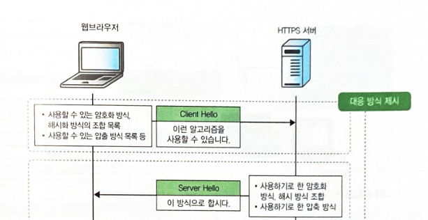

# 주제 : TCP/IP 4계층
# 세부 주제 : SSL/TLS

# 주제 선정 배경

회사에서 JS 관련 패키지를 설치하는 과정에서, npm install ~을 입력하였을 때, 정확히 어떤 에러 문구였는진 모르겠지만 보자마자 아! 프록시 우회 설정이 필요하구나!를 깨달았었음(수십번의 실패에서 비롯된 직감). 회사에서 제공한 프록시 우회 설정을 해주고(IP, PORT) 다시 해보았지만 여전히 안됨. 이때부터는 이유를 알 수 없었음. 물어볼 수 있는 상급자도 없었고, 혼자 해결해야 했기에 GPT에게 물어보니 SSL 인증서 같은게 필요하다함. 일단 cer파일이 있었기 떄문에 이걸 등록했지만 안됨. pem으로 해야한다함. 그래서 openssl 을 통해 pem으로 변환하고, 환경변수에 등록한 뒤로 npm install 정상 작동이 가능해짐. 이땐 그냥 문제가 해결되고 그 뒤로 해야하는게 많아 대충 뭉개고 지나갔지만, 이제 다시 어떻게 문제가 해결되었던건지, 왜 이런 문제가 발생한건지 궁금해서 이 주제를 선정하게 됨.

## TCP/IP 4계층이란?

아래부터 순서대로 링크 계층, 인터넷 계층, 트랜스포트 계층, 애플리케이션 계층의 4개 계층으로 구성되어 있다. 각 계층의 역할은 명확하게 구분되어 있으며, 순서대로 처리한다. 그리고 자신의 처리가 완료되면 다음 계층으로 데이터를 전달한 뒤, 그 처리에는 관여하지 않는다.

1계층, 링크 계층 : 디지털 데이터를 물리적인 전송 매체(케이블이나 전파)로 보내는 변환/변조 및 그 신뢰성을 확보하는 처리를 수행

*디지털 데이터를 물리적인 전송 매체로 어떻게 보낼까?*

2계층, 인터넷 계층 : 수신지가 되는 컴퓨터까지의 통신 경로를 확보하는 처리를 수행

3계층, 트랜스포트 계층 : 애플리케이션을 식별하고, 그에 따라 통신을 제어

4계층, 애플리케이션 계층 : 사용자에게 애플리케이션을 제공

## SSL/TLS

SSL(Secure Sockett Layer)/TLS(Transport Layer Security)는 애플리케이션을 암호화하는 프로토콜이다. 데이터를 암호화하거나, 통신 상대를 인증하는 등으로 중요한 데이터를 보호한다.

다양한 웹사이트를 보는 중, 어느새 URL이 https://로 바뀌어 있고, 주소에 자물쇠 마크가 표시되는 것을 본적이 있을 것이다. 이것은 통신이 SSL로 암호화되어 데이터가 보호되고 있음을 나타낸다. HTTPS는 HyperText Transfer Protocol Secure의 약자로, HTTP를 SSL로 암호화한 것이다.

* TLS는 SSL의 버전을 업데이트한 것이다. 

## GPT에게 물어본 전체 과정

### 1. 사용자가 npm install 명령 실행

- npm은 패키지를 다운로드 하기 위해 npm registry (기본 : https://registry.npmjs.org/)에 HTTPS 요청을 보냄
- HTTPS는 TCP 연결 후 TLS Handshake를 통해 통신 보안 수립

TLS 핸드 셰이크 : 메시지를 암호화하기 전에 암호화하기 위한 정보나 통신 상대를 확인하는 사전 준비를 처리하는 단계. 핸드 셰이크란, TCP에서도 접속에 사용하는 3웨이 핸드셰이크와 단절에 사용하는 4웨이 핸드셰이크가 있지만, 그것과는 완전히 다르다.

SSL은 TCP의 3웨이 핸드셰이크로 TCP 커넥션을 연 뒤, 핸드셰이크 레코드를 이용해서 SSL 핸드셰이크하고, 여기에서 결정된 정보를 기반으로 메시지를 암호화한다. SSL 핸드셰이크는 대응 방식 제시, 통신 상대 증명, 공통키 재료 교환, 최종 확인의 4단계로 구성되어 있다.

이 4단계의 핵심은, 서로 신뢰하고, 대화에 쓸 공통키를 만들고, 그걸로 안전하게 시작하는 과정이다.

1. 대응하는 암호화 방식과 해시 함수 제시

    웹 브라우저가 사용할 수 있는 암호화 방식이나 단방향 해시 함수를 제시한다. 

    ```
    클라이언트 : “안녕하세요! 저는 이런 암호 방식들(TLS1.2, RSA, AES128, ...)을 쓸 수 있어요!”
    서버: “좋아요, 그중에서 이 방식으로 통신하죠!”
    ```

    이를 통해 암호 통신 방식이 합의된다.


2. 통신 상대 증명

    실제 서버와 통신하고 있는가를 서버 인증서로 확인한다. 이 단계는 Server Hello, Cerificate, Server Hello Done의 3가지 프로세스로 구성된다.

    Server Hello : 

    

    서버는 Client Hello에서 받은 암호 스위트 리스트와 자신이 가진 암호 스위트 리스트를 참조해서 일치한 암호 스위트 안에서 가장 우선도가 높은 암호 스위트를 선택한다. 또한, 그 외에도 SSL이나 HTTP의 버전, 공통키 작성에 사용하는 server random 등 클라이언트와 맞춰야만하는 확장 기능의 파라미터도 포함해 Server Hello로 반환한다.

    Certificate : Certificate로 자기 자신의 서버 인증서를 보내고, '자신이 제3자 기관으로부터 인증받은 본인이라는 것'을 증명한다

    Server Hello Done : server Hello Done으로 내 정보는 모두 보냈다 알린다. 웹 브라우저는 받은 서버 인증서를 검증(루트 인증서로 복호화 -> 해시값 비교)하고 올바른 서버인지 확인한다.

    *올바른 서버가 뭐고, 이게 다 먼소리고..*

    그래서! GPT한테 쉽게 설명해달라했다. dog어렵다

    서버 : “이건 내 증명서(SSL 인증서)야. 난 믿을 수 있는 기관이 인증했어!”

    서버는 자신의 공개키가 들어있는 인증서(cer, pem)를 클라이언트에 보낸다.   
    클라이언트는 인증서의 신뢰성(CA 서명)을 검증한다.    
    이 과정을 통해 이 서버가 진짜가 맞다는 것을 증명한다.   

3. 공통키 교환

    애플리케이션 데이터의 암호화와 해시화에 사용할 공통키의 자료를 교환한다.

    클라이언트: “이제부터 둘만 알 수 있는 비밀(세션 키)을 만들 거야!”

    클라이언트는 서버의 공개키로 세션 키 생성용 정보를 암호화해서 전송.   
    서버는 자신의 비공개키로 복호화해서 그 정보를 읽음.   
    결국 둘만 아는 공통된 세션 키가 만들어짐.   

    -> 이 세션키로 이후에 빠르고 안전한 통신을 하게 된다

4. 최종 확인 및 대칭키로 전환
    둘 다: “좋아, 우리 둘 다 준비 끝났어. 앞으로는 이 비밀 키로 대화하자!”

    클라이언트와 서버는 세션 키가 잘 설정되었는지 확인

    이후부터는 세션 키 기반의 대칭 암호화 통신 시작
    (즉, 속도 빠르고 안전한 상태에서 데이터 주고받음)

### 2. TLS Handshake 중 서버 인증서 전달

TLS Handshake 중 통신 상대 증명에 해당된다. 

이때 사내망에서는 다음 중 하나일 수 있지만, 정확히 어떤지는 모른다.

- 사내 프록시 서버가 중간에 끼어 인증서를 대신 발급
- 혹은 내부 레지스트리 서버 자체가 사내 CA에서 발급한 인증서를 사용


### 3. 인증서가 사내 CA 발급이라 신뢰 실패 -> 설치 에러 발생

Nodejs/npm은 OS 또는 Nodejs에 내장된 신뢰된 루트 인증서 목록(CA List)과 비교하여 인증서가 유효한지 검증 함

- 내부망 인증서는 일반적인 공개 CA가 발급한 것이 아니므로, 신뢰 목록에 없음
- 결과적으로 인증서 검증 실패 

### 사내 인증서 .cer 파일을 받아왔지만 또 실패

보통 보안팀이나 프록시 관리자에게서 proxy.cer, company.crt 같은 파일을 제공받음

이 인증서를 신뢰시키는 게 해결 방법의 핵심

### openssl로 pem 파일로 변환

- Nodejs및 많은 오픈소스 도구는 .pem 포맷을 선호한다. 

### .pem 파일 환경 변수 등록

변환한 pem인증서를 nodejs/npm에 인식시켜야 한다.

환경 변수를 설정하는 방법과, 시스템 신뢰 저장소에 등록하는 방법이 존재한다.


### 재시도 시 인증서 신뢰 -> TLS handshake 성공

서버가 인증서를 보내면, 클라이언트가 신뢰하며 handshake 성공.
암호화 된 HTTPS 통신이 정상적으로 시작된다.
이후 npm이 패키지 목록 및 파일을 받아와 설치가 완료된다.

