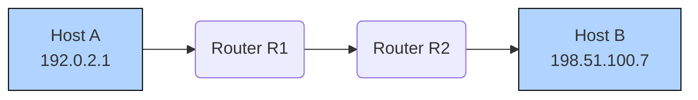
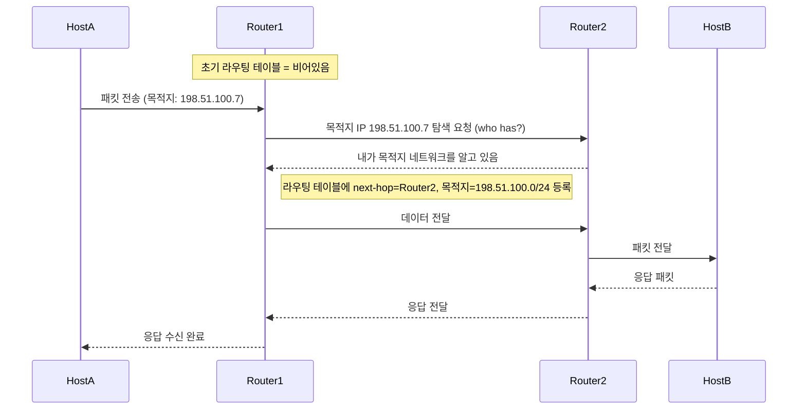
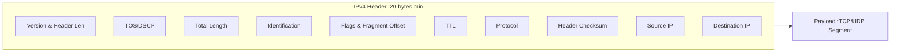
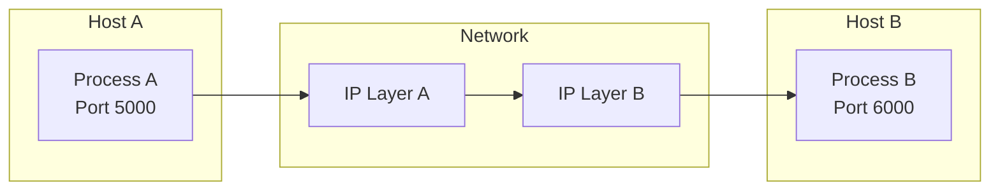
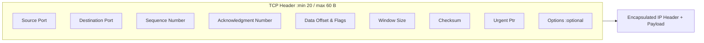
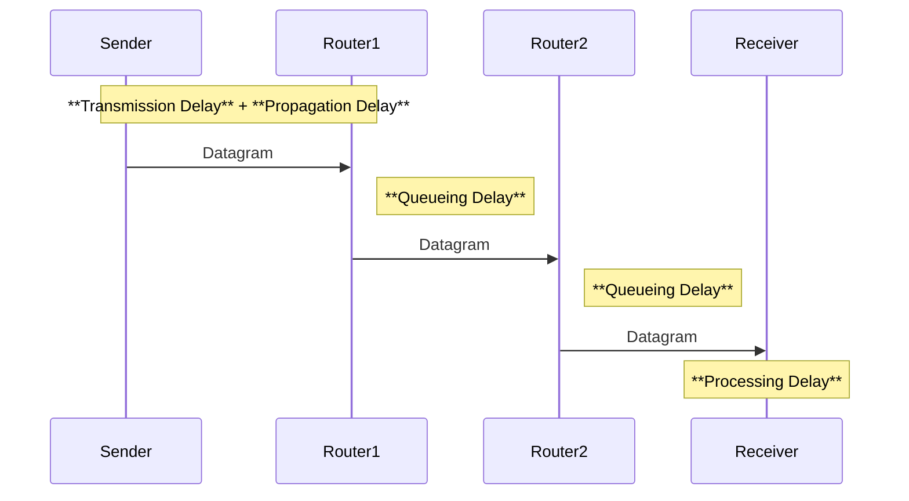
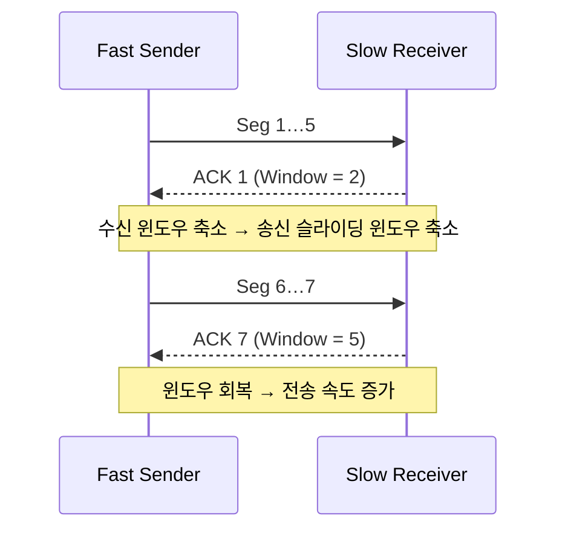
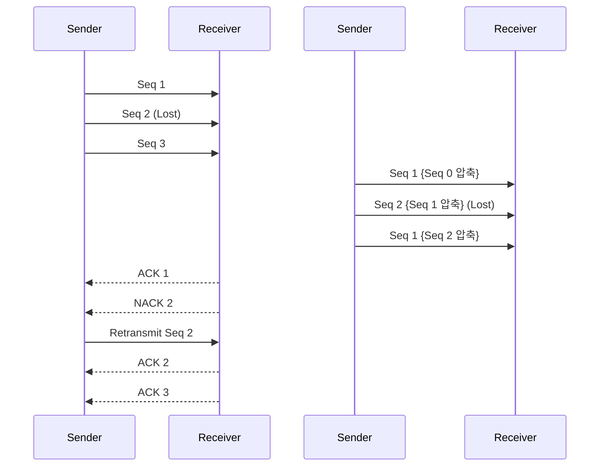

# TCP/IP Study Guide

> 네트워크와 전송 계층의 핵심 개념을 한눈에 정리한 스터디 자료입니다.
> 그림은 **Mermaid** 문법을 사용해 시각화했습니다. (GitHub, Obsidian 등 Mermaid 지원 에디터에서 확인할 수 있습니다)

---

## 1. 네트워크 계층(Network Layer)의 통신 방법

### 1‑1. Host‑to‑Host vs. Hop‑to‑Hop 전달

* **Host‑to‑Host**: 송신 호스트(Source Host) ↔ 수신 호스트(Destination Host) 간 *논리적* 연결 개념
* **Hop‑to‑Hop**: 실제 전송은 **라우터**(Router) 단위로 한 홉씩 이루어짐
* IP 프로토콜은 *best‑effort* 비연결형 서비스를 제공함



### 1‑2. 라우팅 테이블 (Routing Table)

| 목적지 네트워크        | 넥스트 홉(Next‑Hop) | 메트릭/거리 | 인터페이스 |
| --------------- | --------------- | ------ | ----- |
| 198.51.100.0/24 | 10.0.12.2       | 1      | eth0  |
| 203.0.113.0/24  | 10.0.23.2       | 1      | eth1  |
| 0.0.0.0/0       | 10.0.12.2       | 10     | eth0  |

#### 1‑2‑1. 라우팅 테이블 채워지는 과정 (요청 기반 탐색 예시 — 초기 상태 포함)

초기에는 각 라우터의 라우팅 테이블은 비어 있다. 목적지 주소를 가진 패킷이 수신되었을 때, 해당 목적지 네트워크에 대한 경로가 없다면, 인접 라우터들로 탐색 요청(예: ICMP Redirect, 라우팅 프로토콜 메시지 등)을 보낸다. 그 후 경로를 발견하면 해당 정보를 라우팅 테이블에 기록한다.



> 이 과정에서 라우팅 테이블은 각 라우터가 다음 홉과 목적지 네트워크에 대한 정보를 유지하며,
> 목적지 주소와 일치하는 네트워크가 있는 항목을 찾을 때까지 탐색을 수행한다.

### 1‑3. L3 패킷 구조 (IPv4 Datagram)



---

## 2. 전송 계층(Transport Layer)의 통신 방법

### 2‑1. Process‑to‑Process (End‑to‑End) 전달



### 2‑2. L4 패킷 구조 (TCP/UDP Segment)



> 📌 **Note**: UDP 헤더는 8B로 구성되며 `Source Port`, `Destination Port`, `Length`, `Checksum` 필드를 포함합니다.

### 2‑3. UDP 통신 — 지연 요소



* **전파 지연 (Propagation)** ∝ 링크 길이
* **큐 지연 (Queueing)** = 모든 라우터 큐 시간의 합(네트워크 혼잡도에 따라 가변)
* **처리 지연 (Processing)** = 수신/송신 측 패킷 해석 및 변환 시간


### 2‑5. TCP 통신 — 흐름 제어 (Sliding Window)
TCP에서는 송신자가 수신자의 처리 능력 이상으로 데이터를 빠르게 보내면 수신자의 버퍼가 넘치게 된다(Overflow).  
이를 방지하기 위해 흐름 제어(flow control) 메커니즘이 사용됩니다.

흐름 제어 방식: 
- Stop-and-Wait 방식: 한 번에 하나의 세그먼트만 보내고, 확인 응답(ACK)을 받은 뒤 다음 세그먼트를 전송
- ACK + 수신 윈도우 광고 방식: 수신자는 매번 확인 응답 시 자신이 수신 가능한 버퍼 크기(rwnd)를 함께 전송
- Sliding Window 방식: 여러 세그먼트를 연속적으로 보낼 수 있으며, ACK 수신에 따라 윈도우를 '슬라이드'하면서 새 데이터를 계속 전송


#### 슬라이딩 윈도우 방식 설명

송신자는 수신자로부터 rwnd(receiver window) 값을 확인하여, 그 범위 내에서 여러 개의 세그먼트를 연속 전송한다. \
ACK가 도착하면 윈도우의 시작점이 이동(slide)하며, 새로운 데이터 전송이 가능해진다. \
수신자가 처리 속도가 느려져 rwnd를 작게 광고하면, 송신자는 전송 속도를 줄인다. \
반대로 수신자가 버퍼를 비우고 rwnd를 증가시키면 송신자는 다시 빠르게 보낼 수 있다. 



* 수신자 버퍼 상황에 따라 `rwnd` 값을 조절
* 혼잡 제어(Congestion Control)와는 별개의 메커니즘

### 2‑6. TCP 통신 — 오류 제어

TCP 오류 제어는 데이터가 손상되거나 유실되었을 때 이를 탐지하고 복구하는 메커니즘이다.

* **역방향 오류 제어 (Backward Error Control)**: 수신 측이 오류를 탐지하고 송신자에게 재전송을 요청 (ACK/NACK)
* **순방향 오류 제어 (Forward Error Control)**: 송신 측이 오류 가능성을 감안해 미리 오류 복구용 코드를 함께 전송함 (예: FEC, 해밍 코드 등)

TCP는 기본적으로 **역방향 오류 제어**를 사용하며, 수신자가 ACK(또는 중복 ACK, NACK)를 통해 손실을 알리고 송신자가 재전송하는 방식을 사용한다.

반면 실시간 스트리밍, 위성 통신 등에서는 **FEC**를 이용한 순방향 오류 제어가 주로 사용된다.(재전송이 없어서 빠름)

역방향 오류제어와 순방향 오류제어:



* **비트 오류**: Checksum 오류 → 폐기 후 재전송
* **패킷 손실**: Timeout 또는 **Fast Retransmit**(3 중복 ACK 발생 시)
* **중복 수신**: 동일 Seq → 폐기
* **순서 역전**: 수신 버퍼에 정렬 후 처리

---

## 우리가 Request Body를 변수처럼 사용할 수 있는 이유 (TCP의 역할)

HTTP, gRPC, WebSocket 등 다양한 애플리케이션 계층 프로토콜에서 Request Body를 마치 "하나의 완성된 메시지"처럼 처리할 수 있는 이유는 바로 **하위 계층에서 TCP가 순서 보장 및 바이트 재조립을 해주기 때문**이다.

* 실제로는 body 데이터가 여러 TCP segment로 분할되어 전송된다.
* TCP는 각 세그먼트를 **순서대로 재조립**하여 하나의 연속된 바이트 스트림으로 수신 측에 전달한다.
* 개발자는 이를 `InputStream`, `@RequestBody`, `ServletRequest.getInputStream()` 등으로 그대로 읽을 수 있다.

#### 예: Spring에서의 요청 처리

```java
@PostMapping("/upload")
public ResponseEntity<?> handle(@RequestBody MyDto dto) {
    // TCP 덕분에 JSON 전체가 조립된 상태로 전달됨
    // = dto는 요청 보낸 형태와 동일하다
    return ResponseEntity.ok().build();
}
```

* JSON 본문이 여러 패킷으로 나뉘어도 순서가 보장되며
* 일부가 유실되지 않는 한 전체 객체로 변환 가능

> 📌 반대로 UDP를 사용할 경우에는 메시지 전체가 유실되거나 순서가 바뀔 수 있어, 이런 방식의 안정적인 처리 불가능.

##### 예시 상황: UDP로 JSON 전송 시

```json
{
  "user": "kim",
  "message": "hello world",
  "timestamp": 17183991
}
```

이 데이터를 UDP로 전송하면:

* 하나의 메시지가 여러 IP fragment로 나뉘어 전송될 수 있다 (TCP/UDP 동일)
* fragment 중 일부가 손실되면 전체 메시지는 폐기됨 → JSON 파싱 실패 발생
* 순서가 꼬이면 "message" 필드보다 "timestamp"가 먼저 오는 등의 현상 발생 가능
