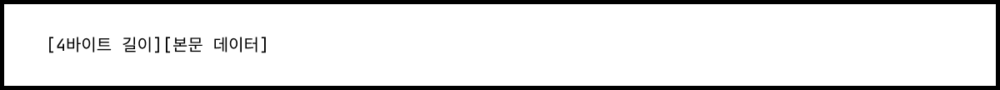
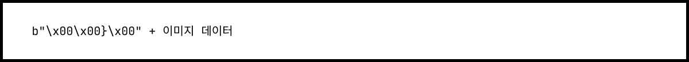
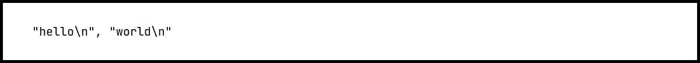
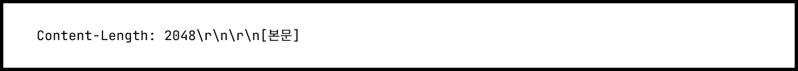

# recv()로 받은 데이터, 어디까지가 한 덩어리일까?

✅ [블로그 원문](https://coder-narak.tistory.com/60)으로 보시면 더욱 편합니다. 


> TCP를 공부하면서 한 가지 의문이 들었습니다. 데이터를 나누는 건 누가 하고, 받은 쪽은 어디까지가 한 덩어리인지 어떻게 알 수 있을까요? 이 글은 그 질문에서 출발해, 왜 개발자가 직접 데이터의 경계를 설계해야 하는지를 설명합니다.

## **1\. TCP는 패킷으로 나누는데, 왜 애플리케이션은 경계를 모를까?**

TCP를 공부하다 보면 "패킷으로 보내니까 당연히 끊어서 보내는 거 아닌가?"라는 생각이 들 수 있다. 맞는 말이다. TCP는 내부적으로 데이터를 세그먼트(segment) 단위로 나눠서 보낸다. 운영체제가 자동으로 적절한 크기로 나눠 전송하고, 네트워크에서는 그것이 패킷 형태로 흐른다.

하지만 중요한 건 이거다. **TCP는 데이터를 끊어서 전송하긴 하지만, 그 경계를 애플리케이션에 알려주지 않는다.**

예를 들어, 클라이언트가 다음과 같이 두 번 데이터를 보냈다고 해보자.

```
sock.sendall(image_1)
sock.sendall(image_2)
```

TCP는 이 두 데이터를 하나로 묶어서 보낼 수도 있고, 여러 조각으로 나눌 수도 있다. 수신 측은 recv()로 다음처럼 받을 수 있다: 

```
data = conn.recv(65536)
```

그러면 이 데이터가 image\_1만 포함된 건지, image\_1과 image\_2가 섞여 있는 건지, image\_1의 일부만 온 건지 알 방법이 없다. TCP는 전송을 안전하게 처리해주는 도구일 뿐, "여기까지가 한 덩어리입니다"라고 말해주지 않는다. 결국, 경계를 구분하는 일은 애플리케이션 개발자의 몫이다.

---

## **2\. TCP가 데이터를 어떻게 보내는가: 바이트 스트림 방식**

TCP는 데이터를 바이트 스트림(byte stream) 방식으로 전송한다. 이 방식은 데이터를 작은 조각(바이트) 단위로 나열해 끊기지 않는 흐름처럼 보내는 방식이다. TCP는 데이터를 보낼 때 메시지 단위를 알려주지 않는다. 대신 보낸 순서를 유지하면서 바이트를 연속적으로 흘려보낸다.  
  
이 때문에 수신 측은 직접 판단해서 데이터를 끊고 나눠야 한다. 어디까지가 하나의 메시지고, 어디서부터 다음 메시지가 시작되는지 알고 있어야 제대로 처리할 수 있다.

---

## **3\. TCP에서 메시지 단위를 정의하는 방법: 프레이밍**

TCP는 데이터를 바이트 흐름처럼 보내기 때문에, 수신 측에서는 반드시 직접 데이터를 끊는 기준을 만들어야 한다. 이 과정을 흔히 프레이밍(framing)이라고 부른다. 프레이밍이란, 바이트 스트림 위에 논리적인 “경계”를 정의하는 것이다. 즉, “이만큼이 한 덩어리야”라고 표시하는 방법을 따로 설계해야 한다는 뜻이다. 

실무에서는 다음 세 가지 방식이 자주 사용된다.

#### **➊ 길이 정보를 앞에 붙이는 방식**

가장 흔한 방식은 전송할 데이터 앞에 길이 정보를 함께 보내는 것이다. 



예를 들어, 이미지가 32,000바이트라면 다음과 같이 구성한다.



수신 측은 먼저 4바이트를 읽어서 전체 데이터 길이를 파악한 다음, 그만큼 바이트를 추가로 읽는다. 구조가 단순하고 메시지 단위가 명확해 유지보수가 쉽다.

#### **➋ 구분자(Delimiter)를 사용하는 방식**

텍스트 데이터를 전송할 때 자주 쓰는 방법이다. 한 메시지의 끝에 특수 문자를 붙이고, 수신 측은 그 문자를 기준으로 데이터를 나눈다. 



recv()로 데이터를 받은 후, 문자열을 split('\\n')처럼 잘라서 처리한다. 이 방식은 간단하지만, 데이터 안에 구분자가 포함될 가능성이 있다면 주의해야 한다.

#### **➌ Content-Length 헤더를 사용하는 방식**

HTTP처럼, **헤더에 길이를 명시한 후 본문을 붙이는 방법**도 있다.



수신 측은 먼저 헤더를 읽고, 그 안의 Content-Length 값을 보고 본문 크기를 계산한다. 이 방식은 텍스트와 바이너리를 함께 다룰 수 있어 유연하다.

세 방식 모두 장단점이 있다. 하지만 공통점은 하나다. **TCP는 경계를 알려주지 않기 때문에, 개발자가 반드시 경계를 정의해야 한다**는 점이다.

---

## **4\. 프레이밍이 없을 때 벌어지는 실제 오류 사례 3가지**

TCP는 데이터를 연속된 흐름으로 보낸다. 그래서 어디서 끊어서 읽을지 결정하지 않으면, 수신 측에서 문제가 생긴다. 이 문제는 단순한 버그가 아니라, 서비스 장애로 이어질 수 있다. 

예를 들어, 

1.  이미지가 합쳐지는 문제  
    : 서버는 image\_1과 image\_2를 구분하지 못한 채 두 개를 하나의 이미지로 저장할 수 있다.
2.  이미지가 잘리는 문제  
    : 클라이언트가 보낸 데이터가 중간에 끊겨 도착할 수도 있다. 그러면 서버는 반쪽짜리 이미지를 저장하게 된다.
3.  다음 요청과 섞이는 문제  
    : 첫 번째 요청에서 경계를 처리하지 않으면, 두 번째 요청의 일부가 첫 번째로 처리되는 일이 생긴다.

이런 문제는 디버깅도 어렵고, 한 번 발생하면 다른 로직까지 영향을 미치기 쉽다. 특히 이미지, 영상, 바이너리 데이터처럼 형식에 민감한 데이터일수록 더 위험하다. 그래서 실무에서는 TCP를 쓸 때 반드시 “프레이밍” 전략을 먼저 정하고 시작한다. 이걸 하지 않으면, 시스템은 언제든지 경계 문제로 실패할 수 있다. 

---

## **5\. TCP가 메시지 단위를 알려주지 않는 근본적인 이유**

TCP는 범용 전송 도구로 설계되었기 때문에, 데이터 전송의 신뢰성과 순서 보장만을 책임진다. 무엇을 보내는지, 어떻게 끊을지는 애플리케이션이 알아서 해야 한다.

서비스마다 요구사항은 다르다:

-   텍스트는 줄 단위로 전송될 수 있다.
-   이미지는 덩어리 단위로 전송된다.
-   스트리밍 서비스는 끊임없이 데이터를 보낸다.

TCP가 메시지 단위를 정의해버리면, 다양한 애플리케이션 요구사항을 모두 충족시킬 수 없다. 대신 TCP는 전송 자체에 집중해 데이터의 순서 보장, 손실 시 재전송, 흐름 제어, 혼잡 제어 등을 제공한다. 이런 구조 덕분에 TCP는 HTTP, FTP, SMTP, SSH 등 다양한 프로토콜의 기반이 될 수 있었다.

---

## **6\. (바쁜 현대인을 위한) 마무리 요약** 

TCP는 데이터를 보내줄 뿐, 그 안에 있는 메시지를 어떻게 나눌지는 알려주지 않는다. 왜냐하면 TCP는 “신뢰성 있는 전송”만을 책임지는 프로토콜이기 때문이다. 그래서 TCP를 사용할 때는 데이터를 어떻게 끊어서 읽을지, 개발자가 직접 정해야 한다. 이 작업을 프레이밍(framing)이라고 부른다.

프레이밍을 하지 않으면 다음과 같은 문제가 생긴다:

-   이미지나 파일이 합쳐지거나, 잘리거나, 섞일 수 있다.
-   서비스가 오작동하거나, 예외가 발생하거나, 데이터를 잃을 수 있다.

이를 해결하려면, 보통 다음 방법 중 하나를 사용한다:

1.  길이 정보를 앞에 붙인다.
2.  특수 문자(delimiter)를 사용한다.
3.  헤더에 Content-Length를 명시한다.

처음에는 불편하게 느껴질 수 있다. 하지만 이 방식 덕분에 TCP는 모든 상황에 맞게 사용할 수 있는 유연한 전송 도구가 되었다.