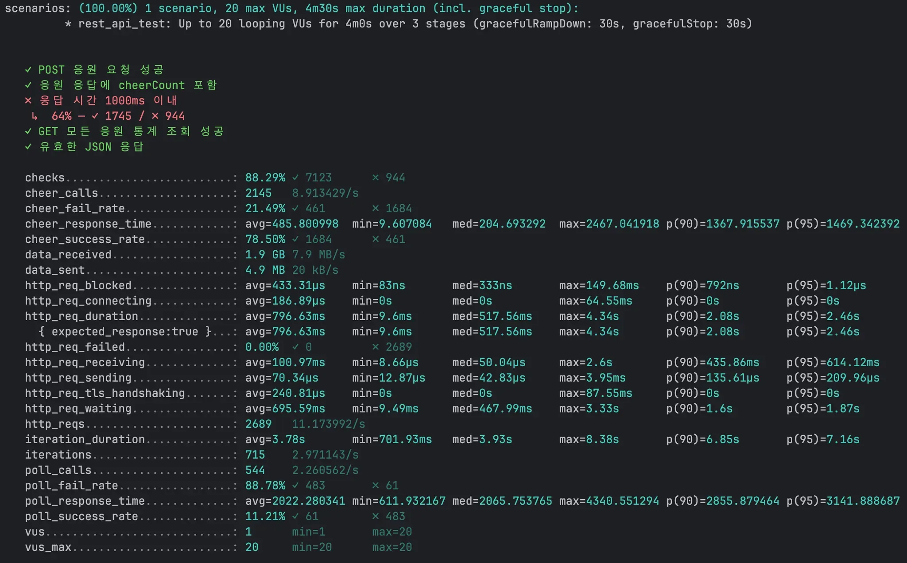
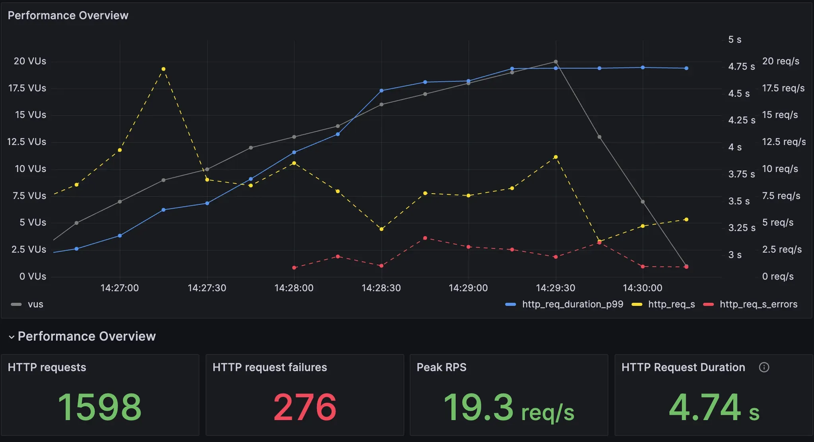
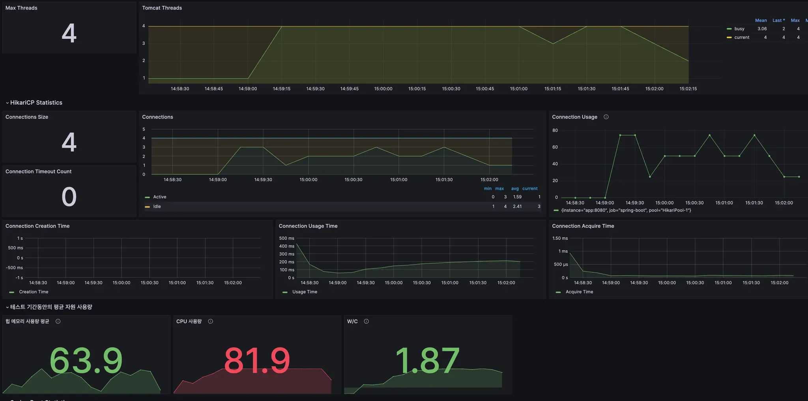

# 채용공고의 '대용량 트래픽 경험', '부하 테스트'로 역량 증명하기

## 1. 신입이 '대용량 트래픽 경험'을 대체 어떻게 해요

백엔드 개발자를 꿈꾸며 채용공고를 스크롤해 본 적이 있다면, 유독 눈에 밟히는 문구를 본 기억이 있을 겁니다.

> "대용량 트래픽 처리 경험 우대"
> 

신입이나 주니어 개발자에게 이보다 더 막막한 말이 또 있을까요? 이제 막 서버를 만들고 API를 개발하는 법을 배웠는데, 경험해보지도 못한 '대용량 트래픽'이라니요. *경험을 쌓으러 왔는데, 경험이 없어서 안 된다니!*


"신입은 대체 어디서 대용량 트래픽을 경험하나요?"

이 질문은 많은 주니어 개발자들의 솔직한 심정일 겁니다. 하지만 잠시 관점을 바꿔 생각해봅시다. 기업은 왜 이 경험을 그토록 중요하게 생각할까요? 단순히 대단한 서비스를 개발한 중고신입을 원하는걸까요?

아닙니다. 기업이 '대용량 트래픽 경험'을 통해 진짜 확인하고 싶은 것은 지원자의 숨은 **'역량'** 입니다. 

1. **시스템의 성능 한계를 인지하고,** 
2. **문제가 발생했을 때 병목을 찾아 분석하며,**
3. **이를 개선해 본 경험** 

그렇다면 이야기는 달라집니다. 실제 수만, 수백만 사용자가 있는 서비스는 경험하지 못했더라도, 그 핵심 '역량'을 기르고 증명할 방법이 있다면 어떨까요?

여기에 대한 가장 확실하고 전문적인 해답이 바로 **부하 테스트(Load Testing)** 입니다.

## 2. 부하 테스트, 제대로 알아보기

### 부하 테스트란 무엇인가? (What)

부하 테스트란, **시스템이 예상되는 최대 부하(Peak Load) 조건에서 안정적으로 성능 목표를 달성하는지 검증하는 활동**을 말합니다.

쉬운 비유를 들어볼까요? 여러분이 인기가 많아질 레스토랑의 셰프라고 상상해봅시다. '부하 테스트'는 평일 점심시간처럼 가장 바쁠 것으로 예상되는 시간에 손님(트래픽)들이 몰려와도, 주문이 밀리지 않고(성능 저하 없이) 음식을 제시간에 제공할 수 있는지(성능 목표 달성) 미리 시험해보는 것과 같습니다.

### 왜 부하 테스트를 해야 하는가? (Why)

부하 테스트를 통해 우리는 다음과 같은 가치를 얻을 수 있습니다.

- **성능 병목 사전 식별:** 서비스 오픈 후 사용자들이 불편을 겪기 전에, 우리 시스템의 어떤 부분이 가장 먼저 느려질지 미리 찾아낼 수 있습니다.
- **시스템 안정성 확보:** "이 정도 사용자까지는 문제없어!"라는 데이터 기반의 확신을 가질 수 있습니다.
- **용량 계획의 근거 마련:** 서버를 몇 대나 증설해야 할지 감에 의존하는 것이 아니라, 실제 테스트 결과를 바탕으로 합리적인 결정을 내릴 수 있습니다.

이것이 바로 기업이 '대용량 트래픽 경험'을 통해 지원자에게 기대하는 능력, 즉 **문제를 예측하고, 데이터에 기반해 판단하는 능력**과 정확히 일치합니다.

## 3. 성공적인 부하 테스트의 3가지 핵심 요소

전문적인 부하 테스트는 단순히 '툴을 돌려보는 것'이 아닙니다. 성공적인 테스트를 위해서는 다음 3가지 핵심 요소를 반드시 고려해야 합니다.

### 핵심 요소 1: 명확한 목표(KPI) 설정

"얼마나 버텨야 성공인가?"를 정의하는 과정입니다. 목표 없는 테스트는 의미 없는 숫자의 나열일 뿐입니다. 우리는 비즈니스 요구사항을 기술적인 목표, 즉 **핵심 성과 지표(KPI, Key Performance Indicator)**로 변환해야 합니다.

주니어 개발자가 부하 테스트 시 반드시 확인해야 할 3대 KPI는 다음과 같습니다.

1. **처리량 (Throughput / RPS):** '초당 요청 처리 수(Requests Per Second)'를 의미합니다. 시스템이 시간당 얼마나 많은 작업을 처리할 수 있는지 나타내는 순수한 성능 지표입니다. (목표 예: 초당 100개의 요청을 처리해야 한다.)
2. **응답 시간 (Response Time):** 요청을 보낸 후 응답을 받기까지 걸리는 시간입니다. 특히 **p95, p99 응답 시간**을 주목해야 합니다. 이는 '전체 요청 중 95%, 99%가 이 시간 안에 응답했다'는 의미로, 일부 사용자가 겪는 극단적인 느림 현상(Tail Latency)을 잡아내는 데 중요합니다. (목표 예: 모든 요청의 95%는 200ms 안에 응답해야 한다.)
3. **에러율 (Error Rate):** 전체 요청 중 서버 에러(HTTP 5xx 등)가 발생한 비율입니다. 이 수치는 당연히 0%에 가까워야 합니다.

### 핵심 요소 2: 현실적인 시나리오 설계

"어떻게 실제 사용자를 흉내 낼 것인가?"를 고민하는 단계입니다. 실제 사용자는 한 가지 행동만 반복하지 않습니다.

예를 들어 쇼핑몰이라면, 단순히 상품 조회 API만 호출하는 것은 현실적이지 않습니다. '로그인 → 상품 검색 → 상세 페이지 조회 → 장바구니 담기'와 같은 **실제 사용자 여정(User Journey)**을 반영해야 신뢰도 높은 결과를 얻을 수 있습니다. 처음에는 간단한 시나리오부터 시작하더라도, 최종적으로는 실제 사용자와 유사한 패턴을 만들어가는 것이 중요합니다.

### 핵심 요소 3: 적절한 도구 선택과 결과 분석

이제 목표와 시나리오를 실행할 도구를 선택할 차례입니다. 세상에는 여러 좋은 부하 테스트 도구가 있으며, 각 도구는 저마다의 철학과 장단점을 가지고 있습니다.

| 도구 | 스크립트 언어 | 주요 특징 | 추천 대상 |
| --- | --- | --- | --- |
| **JMeter** | GUI (XML 기반) | 강력한 GUI와 폭넓은 프로토콜 지원, 방대한 커뮤니티 | QA 전문가 또는 GUI 환경을 선호하는 팀 |
| **nGrinder** | Groovy, Jython | 네이버에서 만든 올인원 플랫폼, 웹 UI 기반의 편리한 테스트 관리 | 테스트 관리를 위한 통합 플랫폼이 필요한 팀 |
| **k6** | JavaScript (ES6) | 개발자 친화적, 'Test as Code' 철학, 매우 적은 리소스로 높은 부하 생성 | 개발자 중심, CI/CD 파이프라인 연동이 중요한 팀 |

k6는 현대적인 JavaScript로 테스트 코드를 작성할 수 있어 프론트엔드/백엔드 개발자 모두에게 친숙하고, 'Test as Code' 철학을 통해 테스트 스크립트를 애플리케이션 코드처럼 버전 관리하고 리뷰할 수 있다는 큰 장점이 있습니다.

k6를 활용한 부하 테스트란 이런 거구나를 간단하게 보여드리도록 하겠습니다. 

아래는 제가 실제로 사용한 k6 test script입니다. 이전에 서울시내 시위 현황을 한 눈에 보여주고, 유저와 상호작용할 수 있는 서비스인 ‘주변시위 Now’를 개발했을 때 사용했던 코드입니다.

```jsx
import http from 'k6/http';
import {check, sleep} from 'k6';
import {Counter, Rate, Trend} from 'k6/metrics';

// 테스트 설정 변수
const CONFIG = {
    BASE_URL: `https://${__ENV.API_HOST}`,
    PROTEST_IDS: [1, 2, 3, 4],
    POLLING_INTERVAL: 3000,
    CHEER_REQUEST_PER_SECOND: 3, // 1초에 3번 응원 요청

    // 테스트 단계 설정
    STAGES: [
        {duration: '1m', target: 100},
        {duration: '2m', target: 600},
        {duration: '1m', target: 0},
    ]
}

// 커스텀 메트릭 정의
const cheerCallCounter = new Counter('cheer_calls');
const cheerResponseTime = new Trend('cheer_response_time');
...

// 성공/실패 카운트를 위한 Rate 메트릭 추가
const cheerSuccessRate = new Rate('cheer_success_rate');
const cheerFailRate = new Rate('cheer_fail_rate');
...

export const options = {
    scenarios: {
        rest_api_test: {
            executor: 'ramping-vus',
            startVUs: 1,
            stages: CONFIG.STAGES,
            gracefulRampDown: '30s',
        }
    }
};

let lastPollTime = 0;

export default function () {
    // 1초에 3번의 POST 요청을 수행하기 위한 반복문
    for (let i = 0; i < CONFIG.CHEER_REQUEST_PER_SECOND; i++) {
        const protestId = CONFIG.PROTEST_IDS[Math.floor(Math.random() * CONFIG.PROTEST_IDS.length)];

        // 응원 요청 파라미터 설정
        const params = {
            timeout: '5s', // 요청 타임아웃 설정
            tags: {name: 'cheer-api'} // 요청 태깅
        };

        // 1. POST 요청으로 응원하기
        try {
            let cheerRes = http.post(`${CONFIG.BASE_URL}/api/cheer/protest/${protestId}`, null, params);

            // POST 요청 메트릭 기록
            cheerCallCounter.add(1);
            cheerResponseTime.add(cheerRes.timings.duration);

            // 응답 검증
            const isSuccess = check(cheerRes, {
                'POST 응원 요청 성공': (r) => r.status === 200,
                '응원 응답에 cheerCount 포함': (r) => {
                    try {
                        const body = JSON.parse(r.body);
                        return body.data && body.data.cheerCount !== undefined;
                    } catch (e) {
                        return false;
                    }
                },
                '응답 시간 1000ms 이내': (r) => r.timings.duration < 1000
            });

            // 성공/실패 카운트 업데이트
            cheerSuccessRate.add(isSuccess);
            cheerFailRate.add(!isSuccess);
        } catch (e) {
            cheerFailRate.add(1);
        }

        // 1초를 3등분하여 각 요청 사이에 간격을 둠 (마지막 요청 후에는 쉬지 않음)
        if (i < CONFIG.CHEER_REQUEST_PER_SECOND - 1) {
            sleep(1 / CONFIG.CHEER_REQUEST_PER_SECOND);
        }
    }

    ...
    }
}
```

아주 간단한 테스트 시나리오로서, sns의 ‘좋아요’ 같은 버튼을 수많은 유저가 난타하는 상황을 가정했습니다.

터미널에서 `k6 run test.js` 명령을 실행합니다. 그러면 아래와 같은 결과를 확인할 수 있습니다.





- **처리량 (RPS):** `http_reqs` 라인의 `11.17./s`를 통해 초당 약 11개의 요청을 처리했음을 알 수 있습니다.
- **응답 시간 (p95):** `http_req_duration` 라인의 `p(95)=2.46s`를 통해 요청의 95%가 2.46s 안에 응답했음을 확인할 수 있습니다.
- **에러율:** `http_req_failed` 라인의 `0.00%`를 통해 실패한 요청이 없었음을 알 수 있습니다.

이 세 가지 지표만 제대로 읽을 수 있어도, 내 시스템의 현재 성능 상태를 파악하는 첫걸음을 성공적으로 뗀 것입니다.



(위 3가지 필수 지표 외에도, 하드웨어 지표 확인 또한 매우 중요합니다!)

## 4. 결과 분석, CS 기본기가 빛을 발하는 순간

테스트를 실행하고 결과를 얻었다면, 이제부터가 진짜입니다. 결과 데이터를 보고 "왜?"라는 질문을 던지며 원인을 파고드는 과정, 즉 **이때부터가 바로 여러분이 갈고닦은 CS 기본기가 단순한 '지식'을 넘어, 문제를 해결하는 '무기'가 되는 순간입니다.**

부하 테스트는 단순히 툴을 사용하는 기술이 아니라, 시스템의 동작 원리를 이해하는 종합 예술에 가깝습니다.

### 🕵🏻‍♂️ 느린 응답의 진짜 범인(병목) 추적하기

가장 흔한 시나리오를 가정해봅시다.

**"테스트 결과, 응답 시간(p95)은 목표치보다 훨씬 느린데, 서버의 CPU 사용률은 20%로 매우 낮습니다. 범인은 누구일까요?"**

이때 CS 지식이 있는 개발자는 다음과 같이 생각할 수 있습니다.

> "CPU가 놀고 있다는 건, 애플리케이션 자체가 복잡한 계산을 하느라 바쁜 게 아니라는 뜻이다. 그렇다면 애플리케이션이 무언가를 하염없이 '기다리는' 상태, 즉 I/O Bound 상황일 확률이 높다."
> 

### 부하 테스트와 CS 지식의 연결고리

이처럼 병목을 추론하는 과정은 여러분이 공부해 온 CS 지식과 직접적으로 연결됩니다.

- **원인 1: 데이터베이스 (I/O Bound)**
    - **의심:** 비효율적인 쿼리로 인해 DB가 응답을 늦게 주고 있을 가능성이 가장 높습니다.
    - **관련 CS 지식:** **데이터베이스** (인덱스, 실행 계획, N+1 문제), **네트워크** (애플리케이션-DB 간 네트워크 지연)
    - **다음 행동:** APM(Application Performance Monitoring) 툴로 느린 쿼리를 특정하거나, 슬로우 쿼리 로그를 확인해 볼 수 있습니다.
- **원인 2: 외부 API 호출 (I/O Bound)**
    - **의심:** 우리 서비스가 의존하는 외부 서비스(결제 API, 소셜 로그인 API 등)가 느리게 응답하고 있을 수 있습니다.
    - **관련 CS 지식:** **네트워크** (HTTP 통신, DNS 조회, TCP Handshake)
    - **다음 행동:** 외부 API 호출 부분의 타임아웃을 측정하고, 해당 서비스의 상태 페이지를 확인해 볼 수 있습니다.
- **반대의 경우: CPU 사용률이 100%에 달할 때 (CPU Bound)**
    - **의심:** 애플리케이션 내부 로직이 매우 복잡하거나, 비효율적인 연산을 반복하고 있을 수 있습니다.
    - **관련 CS 지식:** **자료구조/알고리즘** (비효율적인 알고리즘 사용), **운영체제/JVM** (과도한 스레드 경쟁, 잦은 GC 발생)
    - **다음 행동:** 코드 프로파일러를 사용하여 어떤 함수가 CPU를 많이 사용하는지 분석해 볼 수 있습니다.

이처럼 부하 테스트 결과 분석은 여러분의 CS 기본기를 실제 문제 해결에 적용하고 증명할 수 있는 좋은 경험입니다.

## 5. 실전 대비, 부하 테스트 면접 질문 리스트

여러분이 이 글을 통해 학습한 내용을 바탕으로, 면접관이 부하 테스트와 관련하여 어떤 질문을 할 수 있는지 알아봅시다. 이 질문들에 스스로 답해보며 배운 내용을 정리해보세요.

### **문제 해결/CS 연계 심층 질문**

1. **"부하 테스트를 진행했는데, 서버의 CPU 사용률은 매우 낮은데 응답 시간은 길게 나왔습니다. 이 현상의 가장 유력한 원인은 무엇이라고 생각하며, 그 이유는 무엇인가요?"**
    
    > 💡 답변 Tip: 이 현상이 대표적인 'I/O Bound' 상황임을 설명하세요. 애플리케이션 스레드가 CPU를 사용해 연산하는 대신, 데이터베이스나 외부 API 같은 외부 자원의 응답을 기다리느라 '대기(WAITING/BLOCKED)' 상태에 빠져있기 때문에 CPU 사용률은 낮게 나타난다고 설명하며 OS 지식을 어필할 수 있습니다.
    > 
2. **"지난 문제의 원인을 데이터베이스에서의 병목이라고 가정해봅시다. DB 병목 현상을 좀 더 구체적으로 진단하기 위해 어떤 지표들을, 어떤 순서로 확인하시겠어요?"**
    
    > 💡 답변 Tip: 체계적인 접근법을 보여주는 것이 중요합니다. 예를 들어, (1) APM 툴을 통해 가장 느린 쿼리가 무엇인지 특정합니다. (2) 해당 쿼리의 실행 계획(Execution Plan)을 분석하여 인덱스 누락이나 풀 테이블 스캔(Full Table Scan) 여부를 확인합니다. (3) DB 서버의 CPU, 디스크 I/O, 활성 커넥션 수 등 리소스 상태를 확인합니다. (4) 마지막으로 애플리케이션의 커넥션 풀 상태를 점검합니다. 와 같이 논리적인 단계를 제시하세요.
    > 
3. **"분석 결과, 특정 API에서 N+1 쿼리 문제가 발생하고 있음을 발견했습니다. 이 문제를 어떻게 해결할 것이며, 해결되었는지 여부는 어떤 방법으로 '정량적'으로 검증하시겠습니까?"**
    
    > 💡 답변 Tip: 문제 해결 능력과 검증 능력 모두를 보여줘야 합니다. (1) 해결: JPA 환경이라면 Fetch Join을, 아니라면 쿼리를 수정하여 연관된 데이터를 한 번에 가져오도록 개선하겠다고 답변합니다. (2) 검증: "동일한 부하 테스트 시나리오를 다시 실행하여, ① 목표 API의 p95 응답 시간이 목표치 이내로 개선되었는지, ② 전체 처리량(RPS)이 유의미하게 증가했는지, ③ APM에서 해당 로직의 쿼리 실행 횟수가 실제로 1회로 줄었는지를 수치로 확인하겠습니다." 와 같이 데이터 기반의 검증 계획을 구체적으로 제시하는 것이 핵심입니다.
    > 

## 6. 에필로그: 경험을 넘어, '역량'을 갖춘 개발자로

프롤로그에서 던졌던 질문을 다시 떠올려봅시다. "신입은 어디서 대용량 트래픽을 경험하나요?"

오늘 우리는 그 질문에 대한 답을 찾았습니다. ***경험은 주어지는 것이 아니라, 스스로 만드는 것*입니다.** 여러분은 오늘 이 글을 통해 직접 트래픽을 만들고, 시스템의 성능을 측정하고, 그 결과를 분석하는 방법을 배웠습니다. 단순히 '부하 테스트를 해봤다'는 경험을 넘어, 시스템의 성능을 책임지고 개선할 수 있는 **'역량'** 의 첫 단추를 꿴 것입니다.

'대용량 트래픽 경험'이라는 단어에 더 이상 주눅 들지 마세요. 대신 부하 테스트를 통해 여러분의 서버를 더 깊이 이해하고, 성능 병목의 근본 원리를 파고들며, 데이터에 기반해 문제를 해결하는 진짜 엔지니어로 성장해나가길 응원합니다.

## 이러한 고민을 담은 기술면접 문제집을 만들었습니다

단순한 암기형 부하 테스트 질문은 인터넷에서 쉽게 찾을 수 있습니다. 하지만 실제 성능 문제 상황에서 체계적으로 원인을 분석하고 해결하는 능력을 기르기 위해서는 더 깊이 있는 연습이 필요합니다.

이 글에서 다룬 **"부하 테스트 결과 분석 → 병목 진단 → 개선 → 검증"**의 전체 사이클을 실제 면접 상황에서 논리적으로 설명할 수 있도록, AI 기반 평가 시스템과 함께하는 문제집을 준비했습니다.

**CPU Bound vs I/O Bound 진단**, **데이터베이스 병목 분석**, **N+1 문제 해결과 정량적 검증** 등 실무에서 자주 마주하는 성능 문제들을 직접 분석해보며, 여러분이 얼마나 준비됐는지 확인해보세요!

문제집: [**성능 분석과 병목 해결: 부하 테스트를 통한 시스템 최적화**](https://cs-master.vercel.app/problem-sets/20)

#부하테스트 #성능최적화 #백엔드개발 #기술면접