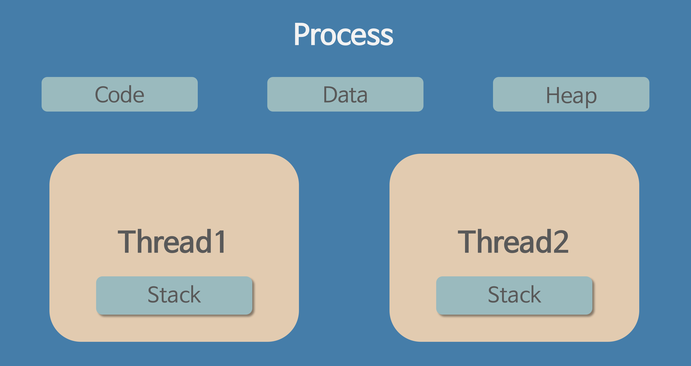

# 멀티 스레딩과 멀티 프로세싱

dash, streamlit과 같은 파이썬 기반의 프레임워크들로 제작된 웹을 윈도우 서버에 배포하였을때 Queue Depth 에러가 났었고, 멀티 스레딩 설정을 추가하니 에러가 해결되었다. 하지만 해당 서비스는 CPU 바운드 작업이 대부분이었는데 멀티 스레딩으로 해결된 점과, 파이썬의 경우 GIL 때문에 동시에 하나의 스레드만 실행하게 되는데 이 문제가 해결된게 이상했다.

이 부분을 아직도 명확하게 이해하지 못하고 찝찝하게 넘어가게 되어 다시 되짚어보려 한다.

## 프로세스와 스레드

파이썬 GIL에 대해 알아보기 전에, 프로세스와 스레드에 대해 간단히 짚고 넘어가보자.

프로세스는 실행 중인 프로그램이다.

프로세스의 구성 요소 중 가장 중요한 것은 메모리이다. 명령어는 메모리에 저장되고, 실행 프로그램이 읽고 쓰는 데이터 역시 메모리에 저장된다. 프로세스가 접근할 수 있는 메모리(주소 공간)는 프로세스를 구성하는 요소이다.

각 프로세스는 메모리 공간을 각각 할당 받으며, 서로의 메모리 공간을 공유하지 않는다. 

그렇다면 스레드는 어떨까?

스레드의 사전적 의미는, "프로세스 내에서 실행되는 여러 흐름의 단위"이다.

스레드는 프로세스 내에 존재하며, 프로세스 하나당 여러개의 스레드를 가질 수 있다. 

이 스레드들은 프로세스의 메모리를 공유하며, 즉, 각 스레드들은 하나의 메모리 공간을 공유하게 된다.

여러개의 스레드들이 공유 자원을 동시에 그 값을 읽고 수정하게 되면 race condition이 발생하며, 이를 위해 Lock이 필요하다는 것은 모두가 알 것이다.

파이썬은 이를 막기 위해 GIL, 즉 Global Interperter Lock을 사용하여 한 시점에 오직 하나의 스레드만 바이트코드를 실행하게 제어한다.

즉, 이 때문에 나머지 스레드들은 대기 상태에 들어가며, 스레드 간에 context switching이 발생하게 된다.

멀티 스레딩 자체는 지원하지만, GIL 때문에 동시에 여러 스레드가 병렬로 CPU를 사용하는 것이 제한된다.

## 내가 마주했던 문제 Queue Depth

Queue Depth는 서버가 동시에 처리할 수 있는 요청 수를 초과해서, 대기열(queue)에 요청이 쌓이다가, 대기열도 꽉 차서 요청을 더 이상 받지 못할 때 발생하는 오류

queue depth = 4 이런식으로 에러가 떴었는데, queue depth = 4는 현재 대기 중인 요청의 수가 4개라는 상태를 의미하며, 그 순간 추가 요청이 들어와서 수용하지 못하게 되면 queue depth 에러가 발생하게 되는 것이다.

요청 하나를 스레드 하나가 처리하게 된다. 파이썬 GIL이 있기도 했고, queue depth 에러를 만나기 전엔 윈도우 서버에서 배포 중이었으며 스레드를 배정하지도 않았다.

위의 에러를 마주하고 스레드 수를 대충 threads=8 이런식으로 배포 시에 추가하니 더 이상 에러가 발생하지 않았다. 

그런데 이상했다, 파이썬 GIL때문에 어차피 threads를 많이 배정해봤자 하나의 스레드가 하나의 요청을 처리하고 있는 동안 다른 요청들은 대기 상태에 걸린다는 것이고, 멀티 스레드를 설정하게 된 의미가 없어지는데? 라고 생각했다. 그런데 이 문제가 해결 된게 이상했다.

큐의 개수를 늘린것도 아닌데, 왜 스레드를 늘리자 문제가 해결이 되었을까?

## 동시성

GIL 때문에 한 번에 하나의 스레드만 실행되는 것은 맞다. 하지만 여러 스레드가 대기 중이면 파이썬 인터프리터가 GIL을 짧은 시간 간격으로 넘겨가며 실행하게 된다.

즉, 동시에 여러 요청을 받을 수 있는 준비된 스레드들이 있다는 것 자체가 의미가 있다.

그런데 스레드 하나가 더 빠르게 요청을 처리할 수 있는게 아닐까? 하는 의문이 또 생겨버렸다.

## 스레드 하나 vs 멀티 스레딩

이론적으로는 컨텍스트 스위칭시 발생하는 오버헤드 비용이 있기 때문에 스레드 하나로 처리하는게 성능이 더 좋지 않을까? 싶지만, 아래의 경우들에는 얘기가 달라진다고 한다.

### I/O 바운드 작업이 포함된 경우

I/O 바운드 작업이란? CPU는 거의 쓰지 않고, 대부분 입출력 장치의 응답을 기다리는데에 시간이 걸리는 작업을 말한다.

DB 쿼리 실행, HTTP API 요청, 사용자 입력 대기 등이 있다.

하나의 스레드가 I/O 작업을 하고 있다면, 그 스레드는 잠시 멈추어야 한다고 한다. 그 동안 다른 요청 처리는 불가능하며 queue가 계속 쌓이게 된다.

그런데 왜 I/O 작업 시 스레드가 멈추는걸까? 그리고 그 스레드가 멈추는 동안 다른 스레드가 다른 요청을 처리하는 것은 일종의 멀티 스레딩이 아닐까?

### I/O 작업 시 스레드가 멈춘다고 말하는 이유

입출력 작업은 대부분 OS 커널에 위임하고, 응답이 돌아올 때까지는 해당 스레드는 CPU를 사용하지 않고 기다리는 상태(blocked)가 된다.

이걸 OS가 어떻게 처리하냐면, read(), recv(), open() 같은 시스템 콜을 호출하게 되면, 해당 스레드는 I/O wait 상태로 전환되게 되고, **다른 스레드나 프로세스가 CPU를 사용하도록 양보하게 된다.**

### 스레드가 멈추는 동안 다른 스레드가 요청을 처리하는 것은 멀티 스레딩이 아닌가?

스레드를 여러개 배정해 놓는다면, 어떤 스레드가 I/O 작업 중일 때, CPU를 점유 중이지 않고 wait 상태가 되니 다른 스레드들에게 CPU를 넘겨주게 되고, 다른 스레드가 동시에 다른 요청을 처리할 수 있게 된다.

즉, GIL이 병렬은 막지만, **I/O 바운드 상황에서는 다른 스레드가 GIL을 받아서 처리할 수 있는 기회가 생기게 된다.**

그래서 I/O 바운드 작업일때에는 멀티 스레딩이 유리하게 된다.

### 그래서 threads=8 로 두었을때 해결이 된 이유는?

I/O 바운드 작업이 섞여있었다는게 된다.

100% CPU 바운드 작업이 아니라, I/O 바운드 작업이 섞여 있었기 때문에 여러개의 스레드를 사용하는 것이 요청을 오히려 빨리 처리할 수 있었다는 의미가 된다.

현재는 리눅스에서 멀티 프로세싱으로 배포 중인데, 멀티 스레딩과 성능 측면에서 어떤 차이점이 있을까?

## 멀티 스레딩 vs 멀티 프로세싱

### 멀티 프로세싱

멀티 프로세싱의 경우 하나의 프로그램을 여러 개의 프로세스로 구성하여, 각 프로세스가 하나의 작업을 처리하도록 하는 것이다.

또한 멀티 프로세싱은 각각의 독립된 메모리 영역을 할당 받았기 때문에, 프로세스 사이에서 공유하는 메모리가 없어, 컨텍스트 스위칭이 발생하면 캐시에 있는 모든 데이터를 모두 리셋하고 다시 캐시 정보를 불러와야 해 오버헤드가 많이 발생하게 된다.

### 멀티 스레딩

멀티 스레딩은 하나의 프로그램을 여러 개의 스레드로 구성하고, 각 스레드로 하여금 하나의 요청을 처리하도록 하는 것이다. 

멀티 스레딩은 메모리는 공유되므로 자원 사용량은 줄지만, 공유 자원에 대한 동기화 비용과 경합 조건이 생길 수 있어 구현 복잡성은 늘어날 수 있다.

하지만 락, 동기화, 경합 위험 때문에 오히려 복잡성은 증가한다는 단점도 존재한다.

## 그렇다면 queue depth 가 발생했던 어플리케이션은 어떻게 배포하는 것이 최적일까?

멀티프로세싱 + 멀티스레딩 조합으로 배포하는 것이 가장 이상적이다.

### 1. CPU-bound 작업이 많기 때문에 멀티프로세싱이 유리하다
CPU-bound 작업은 지속적으로 CPU를 점유하며 GIL을 놓지 않기 때문에, 멀티스레딩 환경에서는 GIL 때문에 실질적 병렬 처리가 불가능하다.

하지만 멀티프로세싱은 프로세스마다 GIL을 독립적으로 가지므로, CPU 코어 수만큼 병렬 처리가 가능하다.

만약 단일 프로세스만 사용하면, CPU-bound 작업 하나가 CPU 자원을 독점하게 되고, 다른 요청들이 큐에 쌓이며 queue depth 에러가 발생할 수 있다.

### 2. I/O-bound 작업도 다수 존재

queue depth 에러가 발생했다는 점은, 동시에 처리해야 할 요청이 꽤 많았다는 의미다.

이는 단순히 CPU-bound만이 아니라, I/O-bound 작업이 많아서 스레드가 I/O 대기로 멈춘 사이에 다른 요청을 동시에 처리할 수 있는 스레드가 부족했을 가능성도 있다.

직접 코드를 분석하진 못했지만, **Streamlit, Dash 기반 애플리케이션은 보통 I/O-bound 작업(DB, 파일, 사용자 인터랙션)**이 섞여 있기 때문에 멀티스레딩으로 동시성을 확보하는 전략이 필요하다고 판단되었다.

그런 작업이 있을 시에는 스레드 역시 일정 수 이상 배정하여 I/O 바운드 작업을 원활하게 수행할 수 있도록 해야할 것이다. 

### 3. 경합 문제는 GIL이 처리한다

파이썬은 GIL 덕분에 스레드 간의 동시 접근에서 **메모리 충돌(race condition)**을 일정 수준 자동으로 막아준다.

물론 GIL은 병렬성에는 제약이 있지만, I/O-bound 처리에서는 충분히 의미 있는 보호 메커니즘이기 때문에,우리가 직접 락이나 세마포어를 구현할 필요는 거의 없다.

하지만 사용자 정의 공유 자원(리스트, 파일 핸들, DB 연결 등)까지 보호하지는 않기 때문에 경우에 따라서는 lock 등의 동기화 기법이 여전히 필요할 수도 있다.
