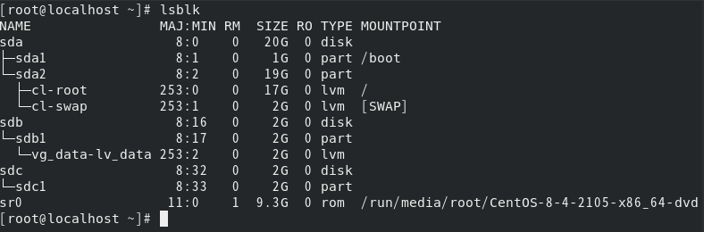
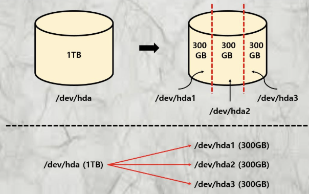
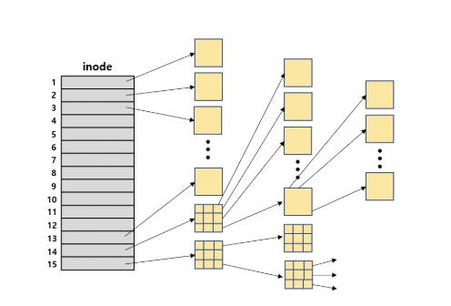

# 리눅스 파일 시스템

리눅스 서버의 용량 관리를 위해 파티션을 나누고, 용량을 많이 차지하는 파일들을 sdb에 옮기면서 파일 시스템에 대해 조금이나마 알게 되었던 것 같다.

그때의 경험들을 하나하나 되짚어 보며 복습도 할겸 리눅스에서 파티션을 나누며 알게 된 것들을 공유해보고자 한다. 

그리고 이 시기에 새로운 노트북을 구입하면서 윈도우 설치를 하는 과정에서 똑같이 파티션 개념이 등장했어서 아주 반가우면서도 빡쳤던 기억도 있다. 파일 시스템의 축복(?)이 내려진 주가 아니었을까 싶다^^

일단 기억을 되짚어가며 적어내려가는 것이라 조금 뒤죽박죽 정신이 없어도 양해를,...

# 파티션을 나누게 된 계기

현재 운영 중인 서버는 총 5대이고, 그 모든 서버의 상태를 한 눈에 파악하기 위해 Grafana라는 시각화 툴을 사용하여 서버들을 모니터링 하고 있었다.

그러다 Gitlab을 운영하는 서버의 Root FS Used 가 90%에 달하는 것을 확인하고 다급(?)하게 서버에 접속해 상태를 확인했다.

Root FS Used는 리눅스의 루트 경로(/)의 사용량이며, 말 그대로 Root FileSystem Used 였다. 

리눅스에서는 sda, sdb, sdc ... 이런식으로 디스크(물리적 장치)를 식별한다.

기본 개념은 /dev/sdx 로, x는 a, b, c 순으로 붙으며 연결된 순서에 따라 결정된다.

| 장치 이름      | 의미                           |
| ---------- | ---------------------------- |
| `/dev/sda` | 첫 번째 디스크 (예: OS 설치된 SSD)     |
| `/dev/sdb` | 두 번째 디스크 (예: 추가한 HDD 또는 USB) |
| `/dev/sdc` | 세 번째 디스크 (예: 또 다른 외장 장치)     |

내가 알기론 sda의 총 용량은 40GB 였는데, 이걸 Gitlab 하나 설치했다고 90%를 사용한다는것은 말이 되지 않았다. Gitlab을 설치하고 운영한지도 채 몇개월이 되지 않았고, 실질적 사용자는 나밖에 없었기 때문에(...) 나 혼자 30GB 가 넘는 양을 썼다는 것도 말이 안됐다.

리눅스 서버에서 `lsblk` 를 입력하면 현재 디스크들의 상황이 출력된다. 



대충 이런식으로 나오는데, 우리 서버의 경우에는 sda의 파티션들 중에서 sda3에 마운트된 경로인 `/dev/mapper/ubuntu--vg-ubuntu--lv` 가 sda의 총 용량중 19G를 할당 받은 상태였고, 그 중 16G를 사용하고 있었다.

그래서 19G 중 16G를 사용중이었기 때문에 90%가 떴던 것이었다.

```
    /dev/mapper/ubuntu--vg-ubuntu--lv 가 뭘까?

    - LVM(Logical Volume Manager) 구조에서 나오는 장치이다.
    - ubuntu-vg : Volume Group 이름
    - ubuntu-lv : Logical Volume 이름
```

sda의 디스크 상당 부분을 LVM 파티션이 차지하고 있고, 이 LVM 안에 / (루트 파일 시스템)이 마운트 되어있는 구조였다.

Grafana는 Prometheus에서 수집한 metric들을 통해 시각화를 해주는데, 수식이 대부분 promql이라는 Prometheus 쿼리로 이루어져 있었다.

```
(node_filesystem_size_bytes{mountpoint="/", fstype!="rootfs"} - node_filesystem_avail_bytes{mountpoint="/", fstype!="rootfs"}) / node_filesystem_size_bytes{mountpoint="/", fstype!="rootfs}
```

분석을 해보면, `mountpoint="/"` 루트 파일 시스템만 대상으로 하며, `fstype!="rootfs"`는 가상 파일 시스템이니 제외하고 계산하였다. 

node_filesystem_size_bytes(전체 파일 시스템 크기) - node_filesystem_avail_bytes(비어있는 공간) / node_filesystem_size_bytes(전체 파일 시스템 크기)

전체 크기에서 남은 공간 빼서, 사용 중인 공간을 계산하였고, 어쨌든 루트의 용량만 체크하고 있었다.

# 파티션

위에서 설명했듯이 sda, sdb, sdc 이런식으로 디스크 장치를 식별한다고 했었다. 그리고 그 안은 파티션들로 나누어져 있고, sda1, sda2, sda3 이런식으로 번호가 붙게 된다.

그러니까 sda라는 디스크를 세개의 파티션으로 나눈 것이다. 



그림 출처 : https://rhrhth23.tistory.com/136

sda1과 sda2는 각 2G, 1.1G만 할당되어 있었고, 19G가 sda3에 할당되어 있었다.

sda의 총 용량은 40G 였고, 여유 용량이 많은 상태였다. sda3의 용량을 40G까지 확장이 가능했다.

그렇게 하면 일단 상황이 마무리 될 수 있었지만, 모든 데이터를 sda에 다 때려박는 이 상황이 조금 맘에 들지 않았다.

sdb라는 디스크가 존재 하고 있었고, 이건 윈도우 기준으로 설명하자면 D드라이브였다.

ssd보다는 성능이 다소 떨어지는 하드디스크였지만 100GB가 할당되어 있었고, 그 공간은 전혀 사용을 하지 않는 상태였다.

보통 이 공간을 리눅스 사용자들은 데이터 저장소라고 부르는 듯 했다.

gitlab에서 용량을 많이 차지 하는 부분은 Repository였다. 앞으로도 계속 데이터가 쌓일테고, 이미 16GB나 사용한것을 보아 금방 또 가득찰게 분명했다.

sdb로의 데이터 이전이 필요하다고 판단했고, 많은 난관 끝에~~(하나하나 적고 싶지만 너무 길고 슬프다)~~ 데이터 이전에 성공했다.

그 과정을 하나하나 적기는 너무 길어 모든 과정을 설명할 수는 없지만, 기억에 남았던 용어들과 개념들을 정리해보았다.

# sda3 파티션 용량 확장 및 sdb 파티션 생성 과정

## sda3 파티션 용량 확장

총 디스크 크기: 40GB (/dev/sda)

기존 파티션:

sda1: 2GB

sda2: 1.1GB

sda3: 19GB

남은 17GB 정도의 미할당 공간이 있었고, 루트가 할당된 sda3의 크기를 최대로 확장하려 했다.

주요 과정은 아래와 같았다.

1. sda3 기존 파티션 삭제 및 재생성 (시작 위치 유지)

파티션을 삭제하면 그 안의 데이터까지 삭제되지 않을까?했는데, 이 작업은 파일 시스템을 건드리지 않고, 파티션 테이블만 수정하기 때문에, 시작 위치만 같게 하면 데이터는 유지된다고 한다.

```
sudo fdisk /dev/sda

```

2. ext4 파일 시스템 크기 확장

파일 시스템 확장

```
sudo resize2fs /dev/sda3
```

## sdb 파티션 생성 

sdb는 파티션이 따로 없는 상태였다. 그래서 sdb1, sdb2라는 파티션을 만들었던 것으로 기억한다.

정확히 어떤 파티션이 어떤 데이터를 저장하고 있는지는 기억이 잘 나지 않지만, 대충 생성했던 과정을 되짚어 보고자 한다.

파티션을 생성할때 아래의 명령어를 입력했었다.

```
sudo parted /dev/sdb mklabel gpt
sudo parted /dev/sdb mkpart primary ext4 0% 100%

```

`parted` : 디스크 파티션 툴
`mklabel gpt` : 디스크 파티션 테이블을 GPT로 초기화(MBR 보다 최신, 큰 용량 지원)
`mkpart` : 파티션 생성
`ext4` : 나중에 사용할 파일 시스템 유형
`0% 100%` : 디스크 전체 사용

그러니까 디스크 전체 용량을 무식하게 sdb1에 다 때려박겠다~라고 이해하면 된다. 물론 진짜 저렇게 무식하게 하진 않았다.

아무튼 여기서 생소한 용어가 많이 등장했다 `GPT`, `ext4`, `MBR` 이게 뭘까?

### GPT, MBR 

이 둘은 모두 디스크의 파티션 구조를 정의하는 방식이다. 디스크를 포맷하거나 파티션을 나눌 때 이 둘 중 하나로 디스크를 초기화하게 된다.

책의 목차라고 이해하면 쉽다.

MBR은 옛날 방식의 목차로, 페이지 수(디스크 크기)와 챕터(파티션 개수)에 제한이 있다.
GPT는 최신 방식의 목차로 무제한에 가까운 페이지와 챕터를 지원한다.

### MBR(Master Boot Record)

- 디스크 맨 앞 512바이트에 파티션 정보와 부트로더가 있다.
- 파티션은 Primary 4개까지만 가능하고, Extented 파티션을 사용하여 논리 파티션을 더 만들 수 있지만 복잡하고 구식이다.

### GPT(GUID Partition Table)

- UEFI 기반 시스템의 표준 파티션 테이블
  → ~~프리도스 노트북이나 본체를 구입해서 직접 OS 설치를 해보았다면 들어보았을 용어다. UEFI에 대해서도 적어보고 싶은데 이미 분량이 너무 길어서 패스~~

- 디스크 앞부분과 끝부분에 파티션 정보가 중복 저장되어 복구에 강하다
- 각 파티션에 GUID 를 부여한다
- CRC 체크섬을 사용해 파티션 데이터 무결성을 검증 할 수 있다.

### MBR과 GPT 비교

| 항목         | MBR (Master Boot Record) | GPT (GUID Partition Table) |
| ---------- | ------------------------ | -------------------------- |
| 등장 시기      | 1983년 (구식)               | 2000년대 이후 (UEFI 도입과 함께)    |
| 파티션 개수 제한  | 최대 4개 (Primary)          | 거의 무제한 (128개 일반적)          |
| 최대 디스크 용량  | 약 2TB                    | 9.4ZB (Zettabyte, 사실상 무제한) |
| 부팅 방식      | BIOS                     | UEFI                       |
| 백업 파티션 테이블 | ❌ 없음                     | ✅ 있음 (디스크 끝에 백업 저장)        |
| 호환성        | 구형 OS와 호환성 좋음            | 최신 시스템에 최적화                |
| 안정성        | 손상 시 복구 어려움              | CRC 기반 무결성 검사 및 백업 있음      |

무지성으로 GPT로 정하기 전에, MBR과 GPT를 대략적으로 비교했고, 현재 sda는 이미 GPT였고, sdb는 msdos로 과거에 MBR 포맷을 쓴 흔적이거나 초기화 상태였다.

sdb도 GPT로 바꾸어서 하나로 통일하는게 안정적이지 않을까 싶었고, 최신 시스템, 최대 디스크 용량, 파티션 개수에 제한 없음이라는 점에서 확장성이 더 높아 GPT로 선택하여 포맷하였다.

# ext4(Fourth Extended Filesystem)

ext4는 리눅스에서 가장 널리 쓰이는 파일 시스템이다. 이전 버전인 ext2, ext3의 후속버전이라고 한다.

지금까지 설명한 것들 중 가장 중요한 개념이라고 할 수 있다.

## ext2

1993년 나온 리눅스 파일 시스템으로, inode 하나 당 하나의 파일을 저장한다. 

가장 중요한 특징으로는 파일을 저장할 때 Block Mapping 방식을 사용한다는 것이다.

현재는 저널링(jounaling)이 없다는 이유로 잘 쓰이지 않지만, 구조 설명용으로는 아주 훌륭한 모델이라한다.

ext2는 디스크를 다음과 같은 구성 요소로 나눠서 파일과 디렉토리를 관리한다.

┌──────────────┐
│ Boot Sector  │ ← 부트로더
├──────────────┤
│ Superblock   │ ← 전체 정보 (파일 수, 블록 수 등)
├──────────────┤
│ Group Desc   │ ← 블록 그룹의 메타 정보
├──────────────┤
│ Block Bitmap │ ← 사용 중인 데이터 블록 표시
├──────────────┤
│ Inode Bitmap │ ← 사용 중인 inode 표시
├──────────────┤
│ Inode Table  │ ← 파일 메타데이터 저장
├──────────────┤
│ Data Blocks  │ ← 실제 파일 내용 저장
└──────────────┘

### inode 

inode는 파일 메타 데이터를 담고 있는 구조체이다. 파일 이름은 inode에 저장되지 않고, 디렉토리 엔드리에서 inode 번호화 연결되어 있다.

### Block Mapping

inode는 이 파일의 내용은 어디에 저장되어 있는가?를 설명하는 블록 위치 목록을 가지고 있다.

ext2에서는 12개의 직접 포인터와 간접 포인터를 사용해 블록을 연결한다.



inode 하나는 하나의 파일을 나타내며, 해당 파일의 데이터가 어디에 저장되어 있는지를 가리키는 포인터(블록 주소들)를 가지고 있다.

ext2에서는 inode 내부에 12개의 직접 포인터를 가지고 있어 최대 12개의 데이터 블록을 직접 가리킬 수 있다.

하지만 시스템에서 사용하는 파일의 수는 수백, 수천개가 넘어가므로 이렇게 표현해서는 역부족이다. 따라서 13번 inode부터는 간접 포인터를 사용하여 하나의 inode가 여러개의 블록을 가리키도록 하여 많은 파일들을 효율적으로 저장할 수 있도록 하였다.

| 포인터 종류                      | 설명                                            |
| --------------------------- | --------------------------------------------- |
| **Direct Pointer (12개)**    | 하나의 블록을 바로 가리킴                                |
| **Single Indirect Pointer** | 포인터 블록을 가리키고, 그 블록이 다시 데이터 블록들을 가리킴 (약 1024개) |
| **Double Indirect Pointer** | 포인터 블록이 포인터 블록을 가리키고, 그게 다시 데이터 블록을 가리킴       |
| **Triple Indirect Pointer** | 3단 중첩된 포인터 구조로, 매우 큰 파일도 저장 가능                |

이를 통해 ext2는 최대 수 기가바이트 수준의 큰 파일까지도 저장이 가능해진다. 

단, 포인터 단계가 깊어질수록 접근 속도는 느려질 수 있다.

## ext3

ext3는 ext2와 유사하지만, 저널링 기능이 생겼다는 특징이 있다. 

저널링은 디스크에 실제 데이터를 쓰기 전에, 변경 내용을 따로 '저널(journal)' 이라는 영역에 기록해두는 방식이다.

저널링은 파일 시스템의 일관성을 유지하고, 예기치 않은 장애 이후에 손상된 파일 시스템을 빠르게 복구하기 위한 기능이다. 저널은 주로 메타데이터(또는 설정에 따라 데이터 포함)의 변경 사항을 추적하기도 하지만, 사용자가 실수로 삭제한 파일을 복구하는 데 직접적인 기능을 하지는 않는다.

## ext4

ext2, ext3의 기본 구조를 유지하면서도 두 가지 큰 구조적 변화를 도입했다.

1. Extents

데이터를 저장할 때, 개별 블록 주소가 아니라 extent(시작 블록 번호 + 길이(블록 수))로 저장

- Extents header : 이 파일의 extent 몇 개인지
- Extent node : 시작 블록 번호, 길이
- B-tree : 큰 파일은 트리로 정리해서 빠르게 찾음

block mapping에 비해 메타 데이터가 적고, 연속된 블록 덩어리 저장으로 fragmentation이 감소하며, 대용량 파일에 매우 효율적이라는 장점이 있다.

- 블록 매핑에 비해 메타 데이터가 적은 이유는, 블록 매핑 방식은 파일이 사용하는 모든 블록 번호를 하나하나 저장하고, 블록 하나당 포인터가 필요하기 때문에 블록이 수천개면 포인터도 수천개가 필요하기 때문에 많은 메타 데이터를 가지고 있기 때문이다. 반면 ext4는 하나의 extent로 연속된 블록을 압축 가능하기 때문에 범위 단위로 포인터가 축소 되어 블록 매핑에 비해 메타 데이터가 적다.

- 잊을만 하면 나타나는 fragmentation...
    파일이 디스크 상에서 연속되지 않은 위치에 조각조각 저장되는 현상

- 대용량 파일에 extents가 효율적인 이유
    블록들을 연속된 범위로 묶어 저장하고, 범위를 트리 형태로 관리함으로써, 대용량 파일의 메타 데이터 부하를 줄이고, 단편화를 줄여 빠르고 효율적인 파일 접근이 가능하다.

2. Delayed Allocation

데이터를 바로 디스크에 쓰지 않고, 메모리에 버퍼링했다가 한꺼번에 씀.

여러 작은 write()를 묶어서 최적 위치에 저장이 가능하여 단편화 감소를 기대할 수 있다.

- block allocation을 더 최적화 할 수 있음
- 디스크 fragmentation 감소, 성능 향상


# 간단한 소감

끝내고 되돌아보니 생각보다 별거 아니었네 싶다. 그렇지만 실제로 진행하는 과정은 엄청 복잡했으며, 리눅스를 다룬지 얼마 되지 않아 굉장히 힘들었었다. 용어 하나하나가 생소했고, 잘못 건드리면 어떡하지라는 불안감에 모든 용어를 다 찾아보며 하나하나 공부해가며 아주 조심스럽게 한단계 한단계 진행했었기에 오래 걸리기도 했다. 

언제 한번 정리해야지~생각만 했는데 CS 스터디에서 이 주제를 다루게 되어 신기했다.

덕분에 복습도 할 수 있어서 좋은 시간이었다.

근데 난 고작 sda 디스크를 확장하고 싶을 뿐이었는데 너무 많은 개념들이 머리에 들어와 다소 어지럽다.

다시 읽어봐야 하는데 무섭다. 그냥 안읽어 볼란다.