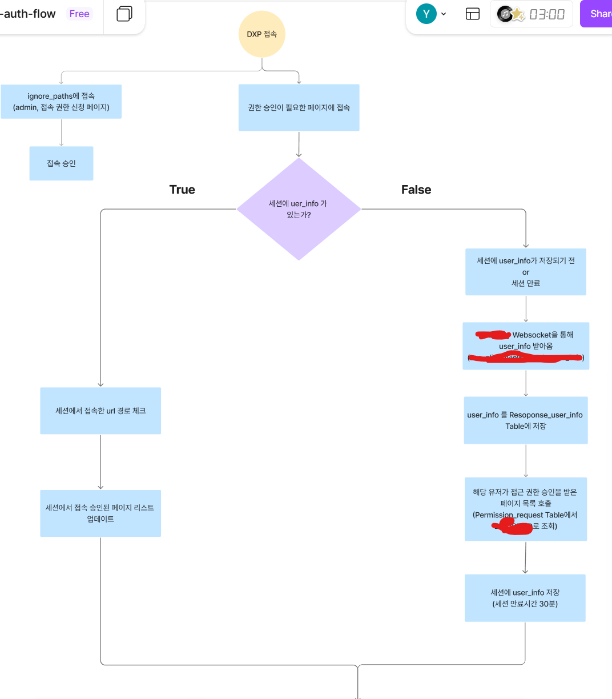
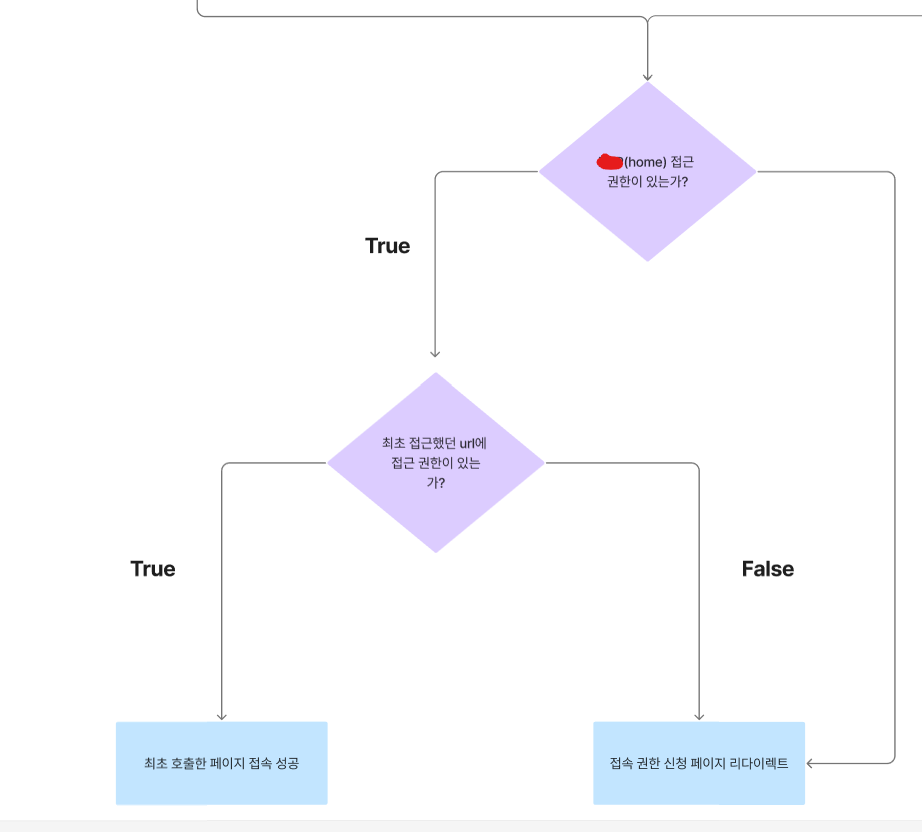

# SSO 인증, 접근 권한, Admin 페이지...

원래는 쿠버네티스 도커 프로젝트를 쓰려고 했으나, 지난주에 거의 완성시킨 사내 프로젝트가 있어 이걸 간단히 소개해보고자 한다.

참고할 자료라곤 AI 가 끝이다보니(책을 읽어라) 개발자분들의 피드백을 들어보고자 작성해본다.

# SSO 인증 로직

지금 이 글을 작성하는 곳은 회사가 아닌지라, 코드를 보고 있는게 아니라서 Figma로 그려놓은 다이어그램으로 설명해보겠다.

일단 SSO 인증은, 사내 업무 시스템에 로그인을 하면, 각 개인 컴퓨터의 localhost SSO Websocket 으로 로그인 정보가 전송된다.

해당 로그인 정보로 사내 시스템 대부분에 로그인이 되는 방식이다.

우리 플랫폼도 전사 오픈(방화벽 해제를 일일이 하지 않아도 사내망에서는 모두 접근이 가능한 사이트)을 하기 위해선 SSO 인증을 통한 로그인 인증 및 권한 부여가 가능해야 한다.

사내 업무 메인 시스템에 로그인을 하고, 우리 플랫폼에 접속을 하면 자동으로 로그인이 된다. 만약 로그인을 하지 않고 우리 플랫폼에 접속하면 자동으로 사내 업무 메인 시스템 로그인 화면으로 리다이렉트 된다.

SSO 웹 소켓 통신으로 암호화된 로그인 정보를 받는다. 암호화를 풀땐 key가 필요하다. key를 통해 복호화를 하고, 로그인 정보 중 일부를 세션에 저장한다. 세션은 Redis로 관리한다. 

Redis에 세션 정보를 저장해두는 이유는, user 정보를 통해 결재를 보내야하기도 하고, User의 ID를 통해 Table에서 권한 승인이 된 페이지 리스트를 조회해서 세션에 저장하기도 해야하고, 권한 신청 시에 user 정보를 받아와야 해서이다. 빠르고 잦은 주기로 가져와야 하는 정보들인데 DB에 저장하게 되면 I/O 지연이 발생하거나, 접속자 수가 많고, 요청이 많을 시에 지연이 발생할 수 있기 때문이다.

페이지 접근 권한 승인의 경우, 접근 신청을 한 뒤에, Admin 페이지에 접근 신청 요청이 오면, Approved 를 해주게 되면 DB Table에 정보가 업데이트 되고, 업데이트와 동시에 세션에도 Approved된 페이지 목록이 리스트로 저장이 되낟. Django 미들웨어로 페이지에 접속할때마다 세션에 저장된 리스트에서 접근 가능한 페이지인지 체크 후 접근 승인이나 거부를 하게 된다.

처음엔 미들웨어에선 페이지에 접속할때마다 Table에 접근해서 업데이트 내역을 체크했었는데, 잦은 주기로 불필요한 접근이 발생한다 생각하여, 접근 가능 페이지가 업데이트 될때 세션을 같이 업데이트 하는 방식으로 변경하였다.

## 장고의 미들웨어

장고의 미들웨어는 요청과 응답 사이의 중간 단계에서 동작하는 가벼운 프레임워크이다. 웹 서버와 뷰 사이를 통과하는 모든 요청과 응답을 가로채서 특정 기능을 처리하는 역할을 한다.

브라우저에서 서버로 요청이 들어오면 미들웨어는 리스트의 위에서 아래 순서로 실행된다(settings.py의 MIDDLEWARE 리스트)

내가 작성한 미들웨어는 두개인데 기억이 잘 안난다. 가물가물..

# Admin 페이지 분리

Admin 페이지는 기존 Django 에서 제공하는 Admin 페이지를 사용했었다. 근데 이렇게 하니 보안팀에서 보안 규칙에 위배된다며(...) 분기하라 명령하였다.

다른 곳에서도 이렇게 할 것 같다고 생각하긴 했다. 슬래시 뒤에 admin만 붙이면 이동이 가능했으니까...해킹하기 너무 쉽다. 아이디 비번만 알아내면 됨

처음엔 프록시를 사용하여 Admin 페이지에 접근하는 로직을 변경하려 했으나, 내가 Django의 Admin 기능을 잘 활용하지 못하는 것도 있었고, 내가 원하는 Admin 기능을 모두 구현하기엔 제약이 많아 그냥 커스텀 하기로 했다.

필요한 Admin 페이지의 기능은 접근 권한 신청이 오면 수락하거나 거절하는 기능, 페이지가 추가될때 해당 정보를 업데이트 하는 기능, 페이지 관리자 정보를 업데이트 하는 기능 등이었다. 각 기능마다 모두 CRUD가 필요했다. 작은 토이프로젝트 여러개를 하는 기분이었다. 근데 이쯤되니 개발에 속도가 붙어서 굉장히 빨리 끝냈던 것 같다. 단순 게시판 CRUD와 별 다를게 없어서 어렵지 않았다. 

페이지 관리자 정보가 있는 이유는, 결재 기능이 필요하기 때문이다.

사용자가 페이지의 접근 권한 신청을 올리게 되면, 결재 API를 통해 결재 요청이 들어간다. 사용자가 원클릭 결재를 올릴 수 있도록 결재 경로는 페이지를 선택하면 자동으로 변경되며,사용자는 상신 의견만 작성하면 된다.

그러면 해당 결재 경로로 결재 통보가 날아가고, 결재가 완료되었다는 통보가 상신인과 플랫폼 관리자(Admin 페이지에서 일해야 하는 사람)에게 날아간다.

그런 통보가 날아오면 상신인은 결재 여부에 따라 접근 권한을 승인 또는 거절하게 된다. 최종적으로 접근 권한을 승인하게 되면 사용자에게 접근 권한이 최종 승인되었으며, 정상적인 접근이 가능하도록 조치를 완료헀다는 메일이 관리자의 이메일 주소를 통해 자동으로 날아간다.(메일 API)

# 앞으로 해야하는 것

비즈니스 로직이 변경될 수도 있다. 그러면 지금까지 짜왔던 로직을 모두 변경해야 한다.

또한 내가 작성한 API의 부하 테스트를 진행해 응답 시간을 측정하여 주요 로직은 최적화가 필요하다.

Nginx를 통해 특정 URL 로 직접 접근하는 요청을 다른 URL로 자동으로 접속되도록 만들어야 한다. 이걸 리버스 프록시라고 하던가. 그리고 정적인 파일들을 로드하는 속도가 빨라져야 한다. Nginx 적용은 필수!

지금은 이정도가 남아있다.

그리고 이 모든게 끝나면 리팩토링을 해야  할 것 같다.(주 업무 시간 외 야근으로 해야할듯) 코드가 개판이다. 그때쯤엔 여기서 보안 사항을 제외한 로직을 어떻게 리팩토링 했는지, 정리했는지를 소개해보고 싶다.

